# 基于 RAG 知识问答与 LLM 驱动推荐的 IT 智能文章推荐与知识问答系统(多语言技术栈构建)


## 描述

这是一个基于多语言技术栈构建的 IT 智能文章推荐与知识问答系统，主要包含以下框架：

- Spring（Java）
- Gin（Go）
- NestJS（Node.js）
- FastAPI（Python）

所有服务通过 SpringCloud Gateway 统一网关进行访问，实现了服务治理、认证授权等功能。

[前端对应仓库地址](https://gitee.com/chu-shichao/react-web-demo)

## 功能说明

1. 基于 Spring Boot 和 MybatisPlus 实现文章发布、修改等操作，文章的创建和显示都支持 Markdown
2. 基于 Spring Boot 和 MybatisPlus 实现用户、分类、评论、点赞、收藏、关注等业务模块
3. 基于 Spring Boot 和 Redis 进行文章分类，用户状态的管理操作
4. 基于 Spring Boot 和 AOP 技术权限校验实现用户端和管理端
5. 基于 Gin 和 ElasticSearch 进行搜索引擎式文章搜索
6. 基于 Gin 和 GORM 实现文章相关数据获取和同步
7. 基于 Gin 和 WebSocket/SSE 实现用户实时聊天功能和消息通知
8. 基于 NestJS 和 Mongoose 进行文章操作日志和 API 日志的查看和分析
9. 基于 NestJS 和 TypeORM 实现文章下载的文章和用户数据获取
10. 基于 FastAPI 和 Hadoop 技术栈实现系统数据的相关分析
11. 基于 FastAPI 和 SQLModel 进行文章相关数据的获取和同步
12. 基于 FastAPI 和 LangChain 实现 RAG 文章检索增强和 Tools 调用 SQL 和 MongoDB，支持 **豆包/Gemini/Qwen** 进行多模型选择

## 设计图

- 系统架构图

  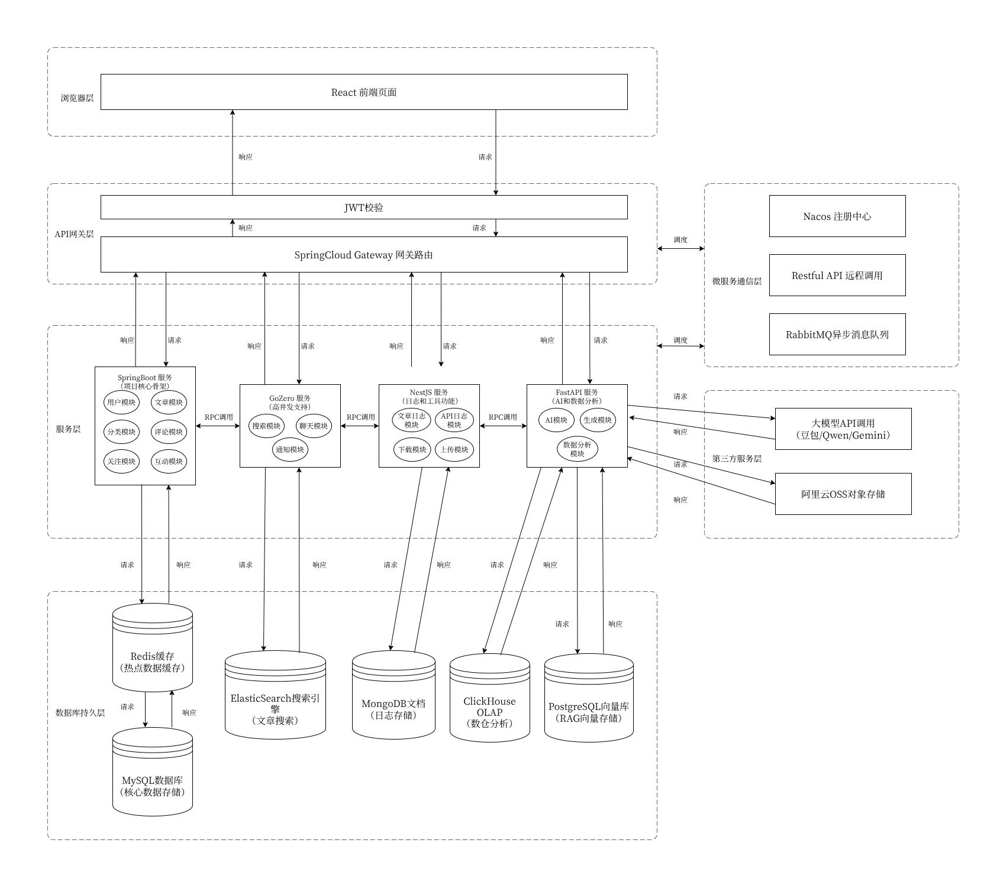

- ER 图

  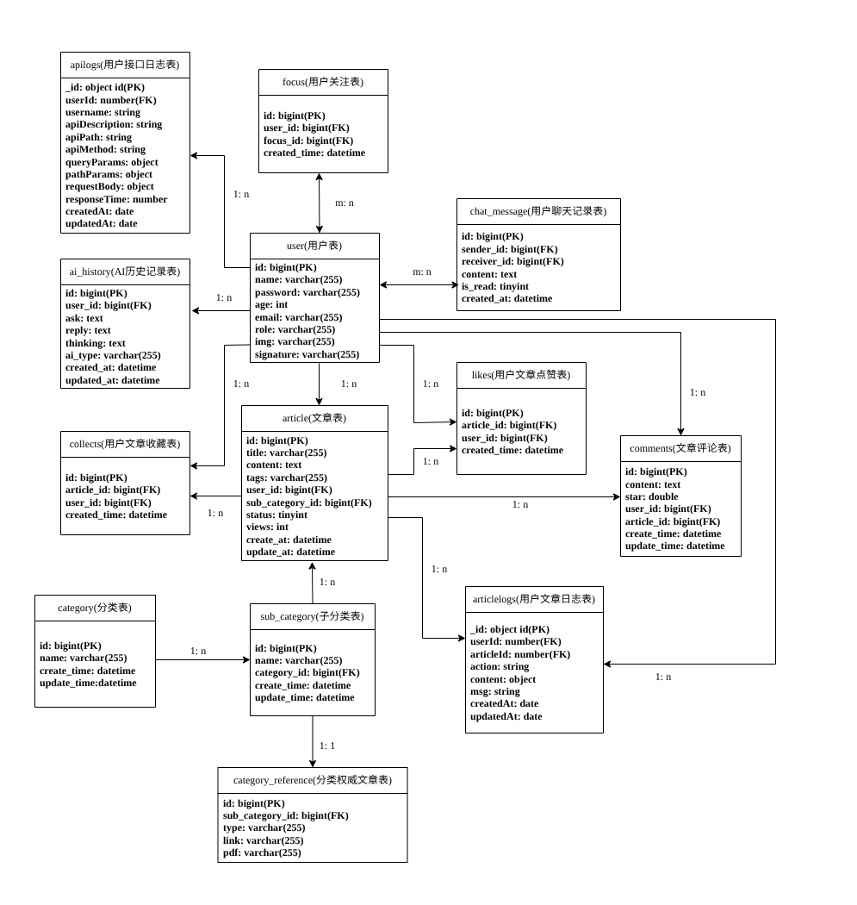

- UML 用例图

  - 管理员 UML

    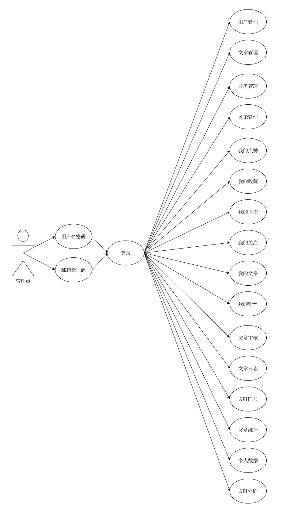

  - 用户 UML

    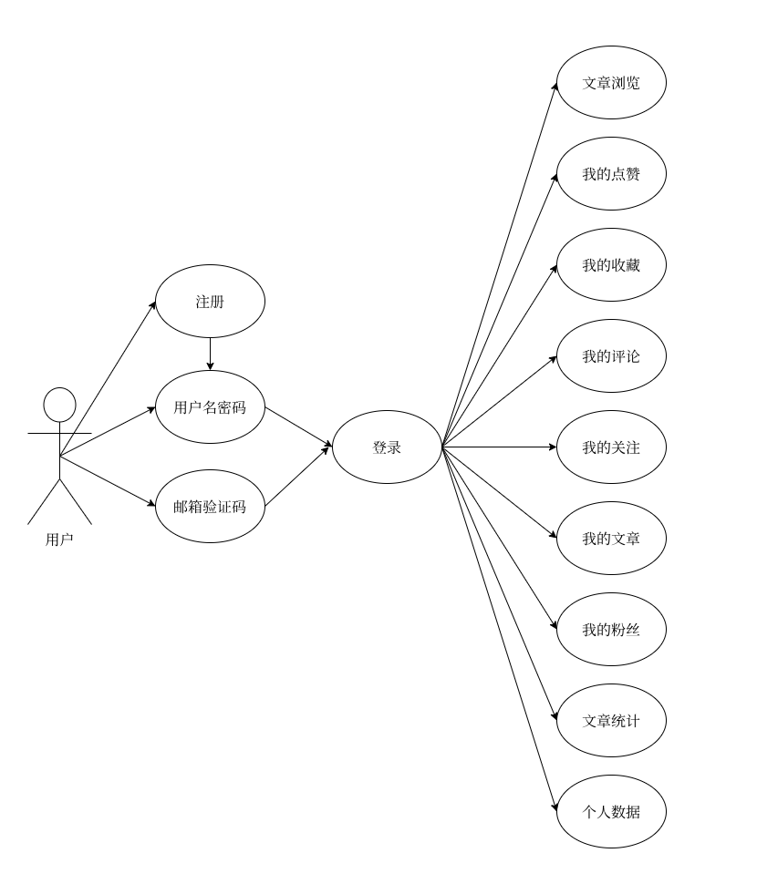

- 系统功能结构图

  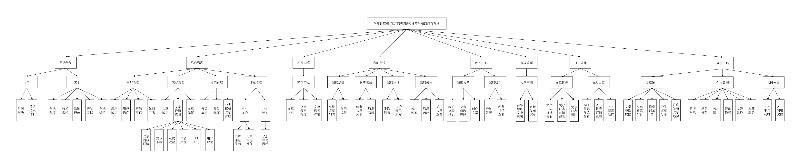

- 流程图

  - 整体核心流程图

    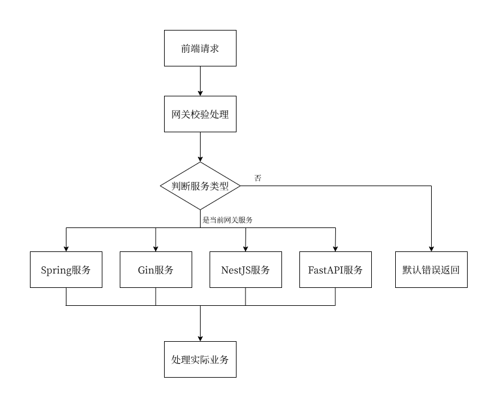

  - 基础系统操作流程图

    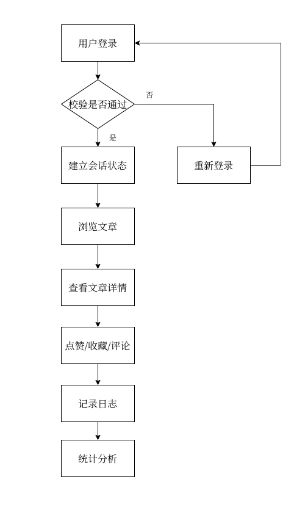

  - Agent 执行流程图

    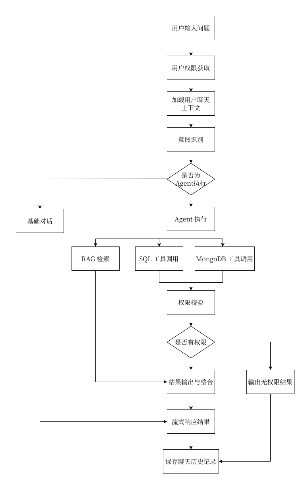

  - 搜索算法流程图

    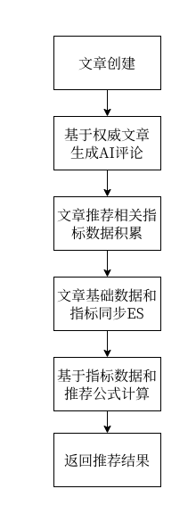

  - 权威文章 AI 评价生成流程图

    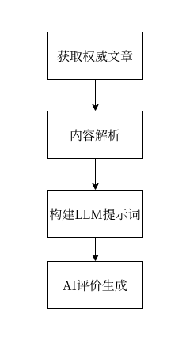

  - CSDN 文章链接爬取流程图

    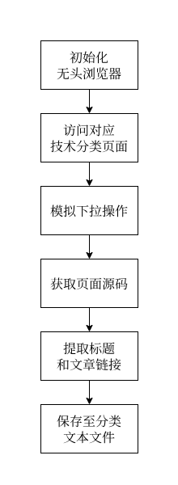

  - 文章链接内容爬取流程图

    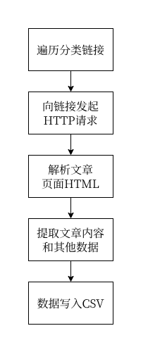

  - 注册/登录流程图

    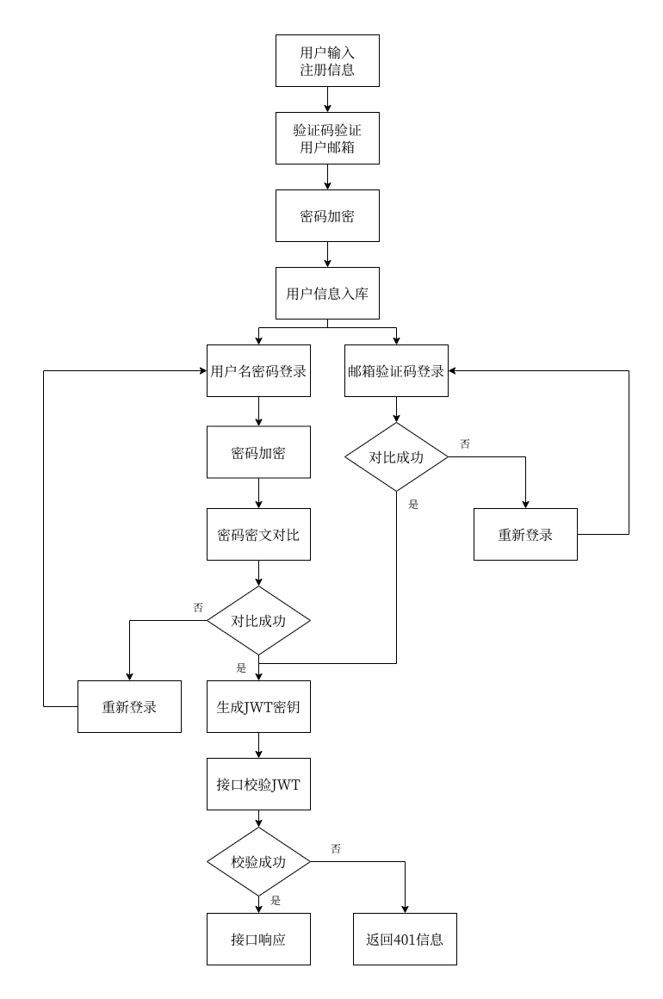

  - AOP 日志记录流程图

    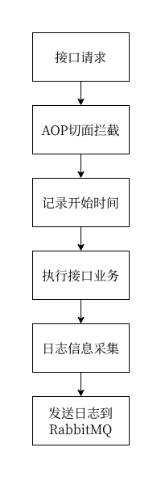

  - AOP 权限校验流程图

    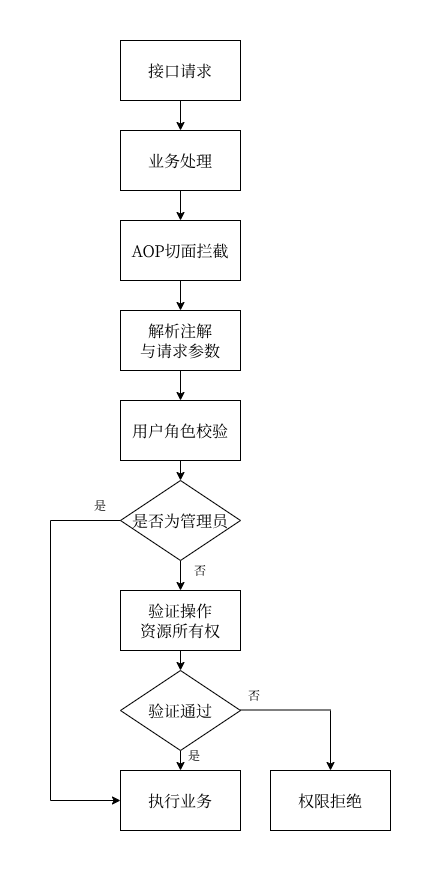

  - 中间件日志记录流程图

    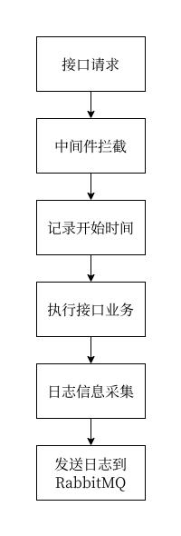

  - 拦截器日志记录流程图

    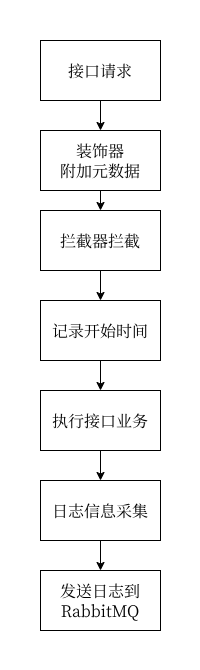

  - 拦截器权限校验流程图

    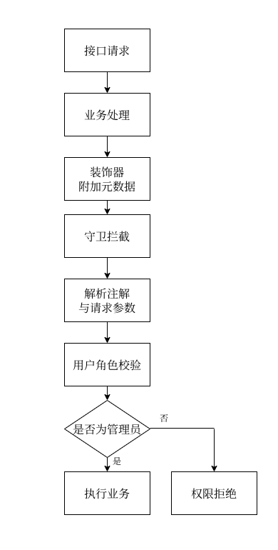

  - 装饰器日志记录流程图

    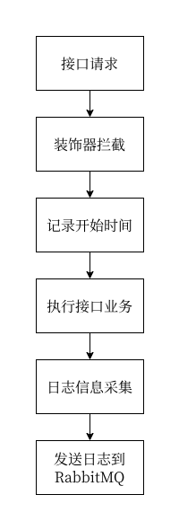

  - 装饰器权限校验流程图

    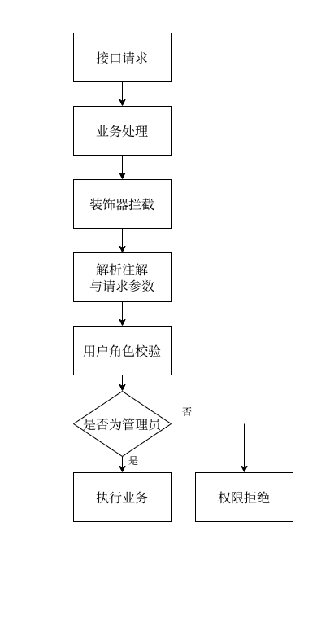

  - 网关登录校验流程图

    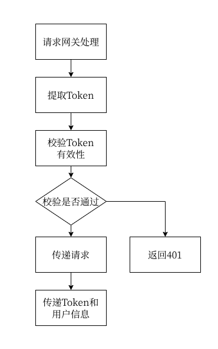

## 技术栈

- Spring Boot：Java 后端框架，支撑系统核心业务服务
- Gin：Golang 后端框架，支持系统高并发服务
- NestJS：Node.js 后端框架，支撑系统日志处理服务
- FastAPI：Python 后端服务，支撑系统数据分析和 Agent 服务
- Spring Cloud Gateway：API 网关
- JWT：身份验证
- Nacos：服务发现与配置中心
- MySQL：关系型数据库，系统核心数据库
- PostgreSQL：RAG 向量数据库
- MongoDB：非关系型数据库，系统日志数据库
- Elasticsearch：搜索引擎，系统搜索优化
- Redis：缓存服务和状态管理
- RabbitMQ：异步消息队列
- Hadoop+Hive：大数据存储与分析
- WebSocket：用户实时聊天
- SSE：实时通知未读消息
- Langchain：大模型调用和 RAG 框架

## 第三方服务

- [火山引擎](https://www.volcengine.com/)
- [Google AI](https://aistudio.google.com/)
- [阿里云百炼平台](https://bailian.console.aliyun.com/)
- [Close AI](https://platform.closeai-asia.com/dashboard)
- [阿里云 OSS](https://oss.console.aliyun.com/overview)

## 环境要求

- Java 17+
- Maven 3.6+
- Go 1.23+
- Node.js 20+
- Bun(可选)
- Python 3.12+
- uv(可选)
- MySQL 8.0+
- PostgreSQL(需要安装向量插件) 15.4+
- MongoDB 5.0+
- Redis 6.0+
- RabbitMQ 3.8+
- Hadoop+Hive(可选)

## 环境设置

> **提示**: 推荐使用 `setup.sh` 配置脚本自动完成以下所有安装步骤。
>
> 如果需要手动配置，可以按照下面的步骤逐个模块进行。

### Spring 部分

使用 Maven 构建：

```bash
cd spring # 进入文件夹
cd gateway # 进入网关
mvn clean install # 下载依赖
```

### Gin 部分

```bash
cd gin # 进入文件夹
go mod tidy # 安装依赖
go install github.com/gravityblast/fresh@latest # 修改热启动工具(推荐)
```

### NestJS 部分

```bash
cd nestjs # 进入文件夹
npm install # 安装npm包
bun install # 或者使用bun安装
```

### FastAPI 部分

使用 uv 进行项目管理：

```bash
cd fastapi

# 安装 uv（如果未安装）
# 参考: https://docs.astral.sh/uv/getting-started/installation/

# 配置 uv 虚拟环境
uv venv --python /usr/bin/python3.11 # 创建虚拟环境时指定 Python

# 激活虚拟环境
source .venv/bin/activate

# 同步依赖（使用国内镜像）
uv sync

# 运行项目
uv run python main.py
```

> 项目使用 uv 进行依赖管理，配置文件为 `pyproject.toml`。镜像源配置在 `~/.config/uv/uv.toml`，内容如下

```toml
[[index]]
name = "aliyun"
url = "https://mirrors.aliyun.com/pypi/simple"
default = true

```

## 环境配置脚本

为了简化项目初始化过程，我们提供了自动化配置脚本 `scripts/setup.sh`，可以自动检测环境、安装依赖并配置所有模块。

### Linux/macOS 使用方式

```bash
# 1. 使用便捷脚本调用（推荐）
./services.sh setup

# 或直接调用
./scripts/setup.sh
```

### 交互式配置

运行脚本后会出现以下交互界面：

```bash
# 根据提示选择要配置的模块
# 选项:
# 1) Spring      - 配置 Spring Boot 服务
# 2) Gin         - 配置 Gin 服务
# 3) NestJS      - 配置 NestJS 服务
# 4) FastAPI     - 配置 FastAPI 服务
# 5) 全部        - 配置所有模块
```

### 脚本功能特性

1. **环境检查**

   - 自动检测 Python、Go、Java、Node.js 等必要工具的安装状态和版本
   - 如果缺少必要工具会给出明确提示

2. **系统依赖管理**（仅 FastAPI 模块需要）

   - 自动检测并安装 PostgreSQL 开发库（`libpq-dev`）
   - 自动安装编译工具（`build-essential`、`python3-dev`）
   - 支持多种 Linux 发行版（Ubuntu/Debian、CentOS/RHEL、Fedora、Arch）

3. **模块化安装**

   - 支持选择性安装特定模块或全部安装
   - 每个模块独立配置，互不影响

4. **智能判断**

   - Spring: 自动检测是否有全局 Maven，如果没有则使用 mvnw
   - Gin: 可选安装 fresh（热重载工具）和 swag（Swagger 文档生成工具）
   - FastAPI: 自动安装 uv 并自动创建 uv 虚拟环境并使用阿里镜像源加速安装

5. **目录自动创建**

   - 自动创建 logs 目录（spring、gin、nestjs、fastapi）
   - 自动创建 static 目录（pic、excel、word）

### 脚本执行流程

```bash
./services.sh setup
```

执行后将按以下流程进行：

1. **检测操作系统** - 识别当前 Linux 发行版
2. **检查环境** - 验证必要工具（Python、Go、Java、Node.js、npm）
3. **创建目录** - 自动创建日志和静态文件目录
4. **选择模块** - 交互式选择要配置的模块
5. **安装依赖** - 根据选择自动安装各模块依赖
6. **完成提示** - 显示后续配置步骤

### 注意事项

- **首次运行**: 建议首次配置时选择"全部"选项，确保所有依赖都正确安装
- **系统权限**: 安装系统依赖时可能需要 sudo 权限
- **网络要求**:
  - Go 模块需要访问 GitHub 和 Go 代理
  - Python 使用 uv 配置项目环境，使用阿里镜像源，国内访问速度较快
  - npm 使用默认源，建议配置国内镜像（如淘宝镜像）
- **虚拟环境**: FastAPI 会使用 uv 自动创建虚拟环境（venv），无需手动创建

### 配置完成后

脚本执行完成后，还需要：

1. **配置各服务的 yaml 文件**（见下方"配置文件说明"章节）
2. **启动基础服务**（MySQL、Redis、MongoDB、Elasticsearch、RabbitMQ、Nacos）
3. **使用运行脚本启动服务**（见"运行脚本配置"章节）

## Docker 容器环境管理

项目提供了 Docker 容器管理脚本，用于快速创建和管理所有依赖的容器服务。

### Docker 容器脚本用法

```bash
# 创建所有容器
./services.sh docker up

# 查看容器状态
./services.sh docker status

# 查看容器日志
./services.sh docker logs <service>

# 停止所有容器
./services.sh docker stop

# 删除所有容器
./services.sh docker delete

# 显示帮助信息
./services.sh docker help
```

### 创建的容器服务

脚本会自动创建以下 Docker 容器：

| 服务              | 端口  | 用户名   | 密码   | 说明                     |
| ----------------- | ----- | -------- | ------ | ------------------------ |
| **MySQL**         | 3306  | root     | 123    | 关系型数据库             |
| **PostgreSQL**    | 5432  | postgres | 123456 | 向量数据库(含 pgvector)  |
| **Redis**         | 6379  | -        | -      | 缓存服务                 |
| **MongoDB**       | 27017 | root     | 123456 | 非关系型数据库           |
| **Elasticsearch** | 9200  | -        | -      | 搜索引擎(7.12.1)         |
| **Nacos**         | 8848  | -        | -      | 服务发现与配置中心       |
| **RabbitMQ**      | 5672  | itheima  | 123321 | 消息队列(管理界面 15672) |

### 脚本功能特性

1. **智能检测**

   - 自动检测 Docker 是否安装和运行
   - 检测端口是否被占用，避免重复创建容器
   - 自动创建项目专用网络 `hcsy`

2. **前置准备**

   - 自动创建数据持久化目录
   - 支持 Elasticsearch IK 分词器安装（可选）
   - 自动生成 Nacos 配置文件

3. **容器管理**

   - 支持查看容器状态
   - 支持查看容器日志
   - 支持停止和删除容器

4. **一键部署**

   - 完整的部署流程自动化
   - 清晰的步骤提示和日志输出

### 快速开始示例

```bash
# 第一次使用：创建所有容器
./services.sh docker up

# 查看所有容器是否正常运行
./services.sh docker status

# 查看 MySQL 容器的日志
./services.sh docker logs mysql

# 需要时停止容器
./services.sh docker stop

# 需要时删除容器
./services.sh docker delete
```

### 注意事项

- **首次创建**: 首次执行 `docker up` 时会创建 Docker 网络，可能需要一些时间
- **数据持久化**: 所有容器的数据都会持久化到宿主机目录
- **Elasticsearch**: 首次创建后会提示是否安装 IK 分词器（可选）
- **Nacos**: 自动生成 `nacos/custom.env` 配置文件，可根据需要修改
- **权限问题**: 如果遇到权限错误，可能需要使用 `sudo` 或将用户加入 docker 组
- 如果有额外创建的组件，按照个人的配置改动配置文件

## 编译和运行项目

> 每个服务都可以独立运行：

### Spring 服务（包括 gateway 网关）

```bash
# 运行Spring服务
cd spring
mvn clean install # 构建项目
mvn spring-boot:run # 启动项目
```

### Gin 服务

```bash
# 运行Gin服务
cd gin
go build -o bin/gin main.go # 构建项目
go run main.go # 运行项目(无修改自启插件)
fresh -c ~/.freshrc # 运行项目(有修改自启插件)
```

### NestJS 服务

```bash
# 运行NestJS服务
cd nestjs
npm run start # development
npm run start:dev # watch mode
npm run start:prod # production mode
npm run start:bun:start # bun运行
npm run start:bun:dev # bun运行(watch)
```

### FastAPI 服务

```bash
# 运行FastAPI服务
cd fastapi
uv run python main.py

# 或指定 Python 版本
uv run --python 3.12 python main.py
```

## 运行脚本配置

所有运行脚本已组织到 `scripts/` 目录中，便于项目管理和维护。

### 快速启动（推荐）

#### Linux/macOS

```bash
# 查看帮助信息
./services.sh help

# ===== 开发环境 =====
# 使用多窗格 tmux 布局启动所有服务（推荐用于开发调试）
./services.sh multi

# 使用顺序窗口模式启动所有服务
./services.sh seq

# 停止所有 tmux 服务
./services.sh stop

# ===== Docker 容器环境 =====
# 构建并启动所有微服务容器
./services.sh docker up

# 构建并启动特定服务容器
./services.sh docker up spring gin

# 仅构建镜像
./services.sh docker build

# 查看容器状态
./services.sh docker status

# 查看容器日志
./services.sh docker logs spring

# 停止所有容器
./services.sh docker stop

# ===== 生产环境 =====
# 构建所有服务到 dist/ 目录
./services.sh build

# 启动所有已构建的服务（后台运行）
./services.sh start

# 启动指定的服务
./services.sh start spring gateway
./services.sh start fastapi gin

# 查看已构建服务的运行状态
./services.sh status

# 查看指定服务的运行状态
./services.sh status spring gin

# 重启所有已构建的服务
./services.sh restart

# 重启指定的服务
./services.sh restart fastapi
./services.sh restart spring gateway nestjs

# 停止所有已构建的服务
./services.sh stop-dist

# 停止指定的服务
./services.sh stop-dist spring fastapi

# 查看服务的最新日志（只支持查看单个服务）
./services.sh logs spring
./services.sh logs fastapi
./services.sh logs gin
```

#### Windows

```powershell
# 启动所有服务（PowerShell）
PowerShell -ExecutionPolicy Bypass -File .\scripts\run.ps1
```

### 直接调用脚本

如果需要直接调用 `scripts/` 目录下的脚本：

#### Linux/macOS

```bash
# 启动服务（多窗格布局）
./scripts/run_multi.sh

# 启动服务（顺序窗口布局）
./scripts/run.sh

# 停止所有服务
./scripts/stop.sh

# 构建所有服务
./scripts/build.sh

# 管理分布式部署的服务

# 启动所有服务或指定服务
./scripts/dist-control.sh start              # 启动所有
./scripts/dist-control.sh start spring gin   # 启动指定

# 停止所有服务或指定服务
./scripts/dist-control.sh stop               # 停止所有
./scripts/dist-control.sh stop fastapi       # 停止指定

# 查看所有服务状态或指定服务状态
./scripts/dist-control.sh status             # 查看所有
./scripts/dist-control.sh status spring      # 查看指定

# 重启所有服务或指定服务
./scripts/dist-control.sh restart            # 重启所有
./scripts/dist-control.sh restart nestjs     # 重启指定

# 查看单个服务的最新日志
./scripts/dist-control.sh logs spring
./scripts/dist-control.sh logs fastapi
```

#### Windows

```powershell
# 启动所有服务
.\scripts\run.ps1
```

### 脚本说明

| 脚本              | 位置       | 功能                                       | 适用系统    |
| ----------------- | ---------- | ------------------------------------------ | ----------- |
| `services.sh`     | 项目根目录 | 便捷启动器，用于快速调用 scripts/ 下的脚本 | Linux/macOS |
| `run_multi.sh`    | scripts/   | 使用 tmux 多窗格布局启动所有服务（推荐）   | Linux/macOS |
| `run.sh`          | scripts/   | 使用 tmux 顺序窗口模式启动所有服务         | Linux/macOS |
| `stop.sh`         | scripts/   | 停止所有 tmux 服务                         | Linux/macOS |
| `build.sh`        | scripts/   | 编译所有服务到 dist/ 目录                  | Linux/macOS |
| `dist-control.sh` | scripts/   | 管理打包后的分布式服务（支持服务指定）     | Linux/macOS |
| `setup.sh`        | scripts/   | 环境初始化和依赖安装                       | Linux/macOS |
| `ssh.sh`          | scripts/   | SSH 远程端口转发配置                       | Linux/macOS |
| `run.ps1`         | scripts/   | PowerShell 脚本，启动所有服务              | Windows     |

### 服务名称

dist-control.sh 和 services.sh 支持以下服务名称：

- `spring` - Spring Boot 服务
- `gateway` - Spring Cloud Gateway 网关服务
- `fastapi` - FastAPI 服务
- `gin` - Gin 服务
- `nestjs` - NestJS 服务

如不指定服务名称，则对所有服务进行操作。

### 注意事项

1. **tmux 依赖**：Linux/macOS 脚本依赖 `tmux`，请确保已安装
2. **执行权限**：Linux/macOS 脚本需要执行权限，可以通过 `chmod +x scripts/*.sh` 来设置
3. **相对路径**：所有脚本都使用相对路径，可以在任何目录下调用项目的脚本
4. **服务依赖**：启动前请确保 MySQL、Redis、MongoDB、Elasticsearch、RabbitMQ、Nacos 等基础服务已运行
5. **logs 命令**：仅支持查看单个服务的日志，如需查看多个服务请依次调用

## 生产环境部署

本项目提供了统一的打包和部署脚本，可以一键打包所有微服务并统一管理。

**快速打包和部署（方法一：使用便捷脚本）：**

```bash
# 1. 一键打包所有服务
./services.sh build

# 2. 启动所有服务
./services.sh start

# 3. 查看服务状态
./services.sh status

# 4. 重启所有服务（代码更新后）
./services.sh restart

# 5. 停止所有服务
./services.sh stop-dist
```

**快速打包和部署（方法二：直接调用脚本）：**

```bash
# 1. 一键打包所有服务
./scripts/build.sh

# 2. 启动所有服务
./scripts/dist-control.sh start

# 3. 查看服务状态
./scripts/dist-control.sh status

# 4. 重启所有服务
./scripts/dist-control.sh restart

# 5. 停止所有服务
./scripts/dist-control.sh stop
```

打包后的文件统一位于 `dist/` 目录，每个服务都包含配置文件、启动/停止脚本和日志文件。

### 脚本说明

- **services.sh**（项目根目录）

  - 便捷启动器，用于快速调用 `scripts/` 下的脚本
  - 支持开发环境和生产环境命令

- **scripts/build.sh**

  - 编译所有服务：Spring、Gateway、FastAPI、Gin、NestJS
  - 将编译结果打包到 `dist/` 目录
  - 包含编译错误检查和日志输出

- **scripts/dist-control.sh**

  - 管理打包后的分布式服务
  - 支持的操作：`start`、`stop`、`status`、`restart`、`logs`

**示例用法：**

```bash
# 第一次部署
./services.sh build
./services.sh start

# 查看运行状态
./services.sh status

# 代码更新后重新部署
./services.sh build
./services.sh restart

# 停止所有服务
./services.sh stop-dist
```

## Docker 容器部署

项目提供了完整的 Docker 支持，可以为每个微服务构建镜像并创建容器。

### 微服务 Docker 快速开始

```bash
# 1. 构建并启动所有微服务容器
./services.sh docker up

# 2. 查看容器状态
./services.sh docker status

# 3. 查看特定服务的日志
./services.sh docker logs spring

# 4. 停止所有微服务容器
./services.sh docker stop
```

### 微服务容器说明

| 服务        | 端口 | 镜像名称             | 容器名称                | 技术栈           |
| ----------- | ---- | -------------------- | ----------------------- | ---------------- |
| **Gin**     | 8081 | `mix-gin:latest`     | `mix-gin-container`     | Go 1.23 + Alpine |
| **NestJS**  | 8082 | `mix-nestjs:latest`  | `mix-nestjs-container`  | Node 20 + Alpine |
| **Spring**  | 8083 | `mix-spring:latest`  | `mix-spring-container`  | Java 17 + Alpine |
| **Gateway** | 9000 | `mix-gateway:latest` | `mix-gateway-container` | Java 17 + Alpine |
| **FastAPI** | 8084 | `mix-fastapi:latest` | `mix-fastapi-container` | Python 3.12      |

### 微服务容器特性

1. **多阶段构建优化**

   - Gin/NestJS/Spring 采用多阶段构建，显著减小镜像体积
   - 生产环境只包含必要的运行时，无构建工具

2. **配置文件支持**

   - 支持挂载 `application.yaml` 和 `application-secret.yaml`
   - 无需重新构建镜像即可修改配置

3. **数据持久化**

   - 日志目录持久化：`logs/<service>/`
   - 文件上传目录持久化：`static/`

4. **健康检查**

   - 容器具有健康检查配置
   - 支持自动重启（`unless-stopped` 策略）

### 高级用法

```bash
# 仅构建特定服务的镜像
./services.sh docker build spring gin

# 仅构建镜像，不启动容器
./scripts/build_and_run_services.sh --build-only

# 手动启动容器时指定配置文件
docker run -d --name mix-spring-custom \
  -p 8083:8083 \
  -v $(pwd)/spring/application.yaml:/app/application.yaml \
  -v $(pwd)/spring/application-secret.yaml:/app/application-secret.yaml \
  mix-spring:latest

# 查看容器日志
docker logs -f mix-spring-container

# 进入容器交互式终端
docker exec -it mix-spring-container bash

# 重启容器（应用新配置）
docker restart mix-spring-container
```

## Kubernetes 集群部署

### 前置要求

部署到 Kubernetes 集群需要以下工具：

- **kubectl**：Kubernetes 命令行工具（>=1.24）
- **Minikube** (本地开发) 或其他 K8s 集群
- **Docker**：用于构建容器镜像

### 工具安装

本项目提供了自动化的 K8s 工具安装脚本：

```bash
# 安装所有必要工具（kubectl + Docker + Minikube）
./scripts/install-k8s-tools.sh all

# 仅安装kubectl
./scripts/install-k8s-tools.sh kubectl

# 仅安装Minikube
./scripts/install-k8s-tools.sh minikube

# 启动Minikube集群
./scripts/install-k8s-tools.sh start-cluster
```

或使用 `services.sh` 便捷脚本：

```bash
# 查看K8s相关命令
./services.sh k8s help

# 安装/检查K8s工具
./services.sh k8s install
```

### 本地开发环境（Minikube）

```bash
# 1. 启动Minikube集群（首次使用）
minikube start --driver=docker

# 2. 构建Docker镜像
./services.sh docker build

# 3. 加载镜像到Minikube
eval $(minikube docker-env)
./services.sh docker build

# 或手动加载：
minikube image load mix-spring:latest
minikube image load mix-gateway:latest
minikube image load mix-fastapi:latest
minikube image load mix-gin:latest
minikube image load mix-nestjs:latest
```

### K8s 部署快速开始

```bash
# 1. 查看可用命令
./services.sh k8s help

# 2. 部署所有服务到K8s集群
./services.sh k8s deploy

# 3. 查看部署状态
./services.sh k8s status

# 4. 查看pod日志
./services.sh k8s logs spring
./services.sh k8s logs gin
./services.sh k8s logs nestjs
./services.sh k8s logs fastapi
./services.sh k8s logs gateway

# 5. 端口转发（本地访问）
./services.sh k8s port-forward spring 8083
./services.sh k8s port-forward gateway 9000

# 6. 进入Pod交互式终端
./services.sh k8s exec spring
./services.sh k8s exec gateway

# 7. 滚动重启服务（应用新配置）
./services.sh k8s restart spring
./services.sh k8s restart gateway

# 8. 删除所有K8s资源
./services.sh k8s delete
```

### K8s 资源说明

项目提供的 K8s 资源文件位于 `k8s/` 目录：

| 文件              | 说明               | 资源类型                          |
| ----------------- | ------------------ | --------------------------------- |
| `namespace.yaml`  | 命名空间和网络策略 | Namespace, NetworkPolicy          |
| `configmap.yaml`  | 服务配置管理       | ConfigMap (5 个)                  |
| `deployment.yaml` | 服务部署和内部服务 | Deployment (5 个), Service (5 个) |
| `ingress.yaml`    | 外部访问入口       | Ingress                           |

**部署配置：**

- **副本数**: 2 (可根据负载调整)
- **资源限制**:
  - Go/Node 服务: 256Mi 内存, 100m CPU
  - Java 服务: 512Mi 内存, 200m CPU
  - Python 服务: 256Mi 内存, 100m CPU
- **健康检查**: 所有 Pod 都包含存活探针(livenessProbe)和就绪探针(readinessProbe)

### 访问服务

**通过 kubectl port-forward：**

```bash
# 转发网关到本地 9000 端口
kubectl port-forward -n mix-web-demo svc/gateway 9000:9000

# 然后访问: http://localhost:9000
```

**通过 Ingress（集群内）：**

```bash
# 获取 Ingress 地址
kubectl get ingress -n mix-web-demo

# 然后访问相应的路由
http://<ingress-ip>/        # Gateway
http://<ingress-ip>/gin     # Gin服务
http://<ingress-ip>/nestjs  # NestJS服务
http://<ingress-ip>/spring  # Spring服务
http://<ingress-ip>/fastapi # FastAPI服务
```

### 高级用法

```bash
# 查看详细的服务信息
./services.sh k8s describe spring

# 监控部署进度
./services.sh k8s rollout-status gateway

# 直接调用k8s-deploy.sh获取更多选项
./scripts/k8s-deploy.sh help

# 手动应用K8s清单文件
kubectl apply -f k8s/namespace.yaml
kubectl apply -f k8s/configmap.yaml
kubectl apply -f k8s/deployment.yaml
kubectl apply -f k8s/ingress.yaml

# 查看集群中的所有资源
kubectl get all -n mix-web-demo

# 查看Pod的详细信息
kubectl describe pod <pod-name> -n mix-web-demo

# 查看服务的端点
kubectl get endpoints -n mix-web-demo
```

### 故障排查

```bash
# 检查Pod状态
kubectl get pods -n mix-web-demo

# 查看Pod详细信息
kubectl describe pod <pod-name> -n mix-web-demo

# 查看Pod日志
kubectl logs <pod-name> -n mix-web-demo

# 查看事件日志
kubectl get events -n mix-web-demo --sort-by='.lastTimestamp'

# 进入Pod容器
kubectl exec -it <pod-name> -n mix-web-demo -- /bin/bash

# 检查资源使用情况
kubectl top nodes
kubectl top pods -n mix-web-demo

# 检查ConfigMap是否正确挂载
kubectl get configmap -n mix-web-demo
kubectl describe configmap <config-name> -n mix-web-demo
```

### Docker 和 K8s 对比

| 对比项       | Docker              | Kubernetes            |
| ------------ | ------------------- | --------------------- |
| **部署范围** | 单机或 Docker Swarm | 集群（多机）          |
| **可扩展性** | 有限                | 自动扩展(HPA)         |
| **资源管理** | 基础                | 高级(requests/limits) |
| **自动恢复** | 手动                | 自动(ReplicaSet)      |
| **更新策略** | 重启容器            | 滚动更新              |
| **配置管理** | 环境变量+文件       | ConfigMap/Secret      |
| **用途**     | 开发、小型生产      | 大规模生产、云原生    |

## 基础服务组件初始化

### 确保已安装并启动以下数据库服务：

- MySQL
- PostgreSQL
  - 需要安装 `pgvector`插件
- MongoDB
- Redis
- Elasticsearch
- RabbitMQ
- Nacos

### MySQL 表创建(可选，代码会自动创建)

- 在配置文件中指定对应的数据库
- 创建用户表

```sql
CREATE TABLE user (
    id BIGINT PRIMARY KEY AUTO_INCREMENT COMMENT '用户ID',
    name VARCHAR(255) NOT NULL UNIQUE COMMENT '用户名',
    password VARCHAR(255) NOT NULL COMMENT '密码',
    email VARCHAR(255) UNIQUE COMMENT '邮箱',
    age INT COMMENT '年龄',
    role VARCHAR(255) NOT NULL COMMENT '用户权限',
    img VARCHAR(255) COMMENT '用户头像',
    signature VARCHAR(255) COMMENT '个性签名'
) COMMENT='用户表'
```

- 创建文章表

```sql
CREATE TABLE articles (
    id BIGINT PRIMARY KEY AUTO_INCREMENT COMMENT '文章id',
    title VARCHAR(255) NOT NULL COMMENT '文章标题',
    content LONGTEXT NOT NULL COMMENT '文章内容',
    user_id BIGINT NOT NULL COMMENT '用户id',
    sub_category_id BIGINT NOT NULL COMMENT '子分类id',
    tags VARCHAR(255) NOT NULL COMMENT '文章标签',
    status TINYINT NOT NULL COMMENT '文章状态',
    views INT NOT NULL COMMENT '文章浏览量',
    create_at DATETIME DEFAULT CURRENT_TIMESTAMP COMMENT '创建时间',
    update_at DATETIME DEFAULT CURRENT_TIMESTAMP ON UPDATE CURRENT_TIMESTAMP COMMENT '更新时间'
) COMMENT='文章表'
```

- 创建分类表

```sql
CREATE TABLE category (
    id BIGINT PRIMARY KEY AUTO_INCREMENT COMMENT '主键',
    name VARCHAR(255) NOT NULL COMMENT '分类名称',
    create_time DATETIME DEFAULT CURRENT_TIMESTAMP COMMENT '创建时间',
    update_time DATETIME DEFAULT CURRENT_TIMESTAMP ON UPDATE CURRENT_TIMESTAMP COMMENT '更新时间'
) COMMENT='分类表';
```

- 创建子分类表

```sql
CREATE TABLE sub_category (
    id BIGINT PRIMARY KEY AUTO_INCREMENT COMMENT '主键',
    name VARCHAR(255) NOT NULL COMMENT '子分类名称',
    category_id BIGINT NOT NULL COMMENT '所属分类ID',
    create_time DATETIME DEFAULT CURRENT_TIMESTAMP COMMENT '创建时间',
    update_time DATETIME DEFAULT CURRENT_TIMESTAMP ON UPDATE CURRENT_TIMESTAMP COMMENT '更新时间',
    FOREIGN KEY (category_id) REFERENCES category(id) ON DELETE CASCADE
) COMMENT='子分类表';
```

- 创建权威参考文本表

```sql
CREATE TABLE category_reference (
    id BIGINT PRIMARY KEY AUTO_INCREMENT COMMENT '主键',
    sub_category_id BIGINT NOT NULL COMMENT '子分类ID',
    type VARCHAR(255) NOT NULL COMMENT '权威参考文本类型，link/pdf',
    link VARCHAR(255) COMMENT '权威参考文本链接',
    pdf VARCHAR(255) COMMENT '权威参考文本PDF链接（OSS）',
    UNIQUE KEY uk_sub_category (sub_category_id),
    FOREIGN KEY (sub_category_id) REFERENCES sub_category(id) ON DELETE CASCADE
) COMMENT='分类权威参考文本表';
```

- 创建用户聊天历史记录表

```sql
CREATE TABLE `chat_messages` (
    `id` BIGINT UNSIGNED NOT NULL AUTO_INCREMENT COMMENT '消息ID，主键',
    `sender_id` VARCHAR(50) NOT NULL COMMENT '发送者ID',
    `receiver_id` VARCHAR(50) NOT NULL COMMENT '接收者ID',
    `content` TEXT NOT NULL COMMENT '消息内容',
    `is_read` TINYINT NOT NULL DEFAULT 0 COMMENT '是否已读，0未读，1已读',
    `created_at` DATETIME(3) DEFAULT CURRENT_TIMESTAMP(3) COMMENT '创建时间',
    PRIMARY KEY (`id`),
    KEY `idx_sender_receiver` (`sender_id`, `receiver_id`)
) ENGINE=InnoDB DEFAULT CHARSET=utf8mb4 COLLATE=utf8mb4_unicode_ci COMMENT='聊天消息表';
```

- 创建文章评论表

```sql
CREATE TABLE comments (
    id BIGINT NOT NULL PRIMARY KEY AUTO_INCREMENT COMMENT 'Primary Key',
    content TEXT COMMENT '评论内容',
    star DOUBLE COMMENT '星级评分，0~10',
    user_id BIGINT NOT NULL COMMENT '用户 ID',
    article_id BIGINT NOT NULL COMMENT '文章 ID',
    create_time DATETIME DEFAULT CURRENT_TIMESTAMP COMMENT 'Create Time',
    update_time DATETIME DEFAULT CURRENT_TIMESTAMP ON UPDATE CURRENT_TIMESTAMP COMMENT 'Update Time'
) COMMENT '文章评论表';
```

- 创建 AI 聊天历史记录

```sql
CREATE TABLE `ai_history` (
    `id` BIGINT NOT NULL AUTO_INCREMENT,
    `user_id` BIGINT NOT NULL,
    `ask` TEXT NOT NULL,
    `reply` TEXT NOT NULL,
    `thinking` TEXT,
    `ai_type` VARCHAR(30),
    `created_at` DATETIME DEFAULT CURRENT_TIMESTAMP,
    `updated_at` DATETIME DEFAULT CURRENT_TIMESTAMP ON UPDATE CURRENT_TIMESTAMP,
    PRIMARY KEY (`id`)
) COMMENT 'AI聊天记录';
```

- 创建文章用户点赞表

```sql
CREATE TABLE IF NOT EXISTS likes (
    id BIGINT PRIMARY KEY AUTO_INCREMENT COMMENT '主键',
    article_id BIGINT NOT NULL COMMENT '文章ID',
    user_id BIGINT NOT NULL COMMENT '用户ID',
    created_time TIMESTAMP DEFAULT CURRENT_TIMESTAMP COMMENT '创建时间',
    UNIQUE KEY uk_article_user (article_id, user_id),
    KEY idx_user_id (user_id),
    KEY idx_created_time (created_time)
) ENGINE = InnoDB DEFAULT CHARSET = utf8mb4 COLLATE = utf8mb4_unicode_ci COMMENT = '文章用户点赞表';
```

- 创建文章收藏表

```sql
CREATE TABLE IF NOT EXISTS collects (
    id BIGINT PRIMARY KEY AUTO_INCREMENT COMMENT '主键',
    article_id BIGINT NOT NULL COMMENT '文章ID',
    user_id BIGINT NOT NULL COMMENT '用户ID',
    created_time TIMESTAMP DEFAULT CURRENT_TIMESTAMP COMMENT '创建时间',
    UNIQUE KEY uk_article_user (article_id, user_id),
    KEY idx_user_id (user_id),
    KEY idx_created_time (created_time)
) ENGINE = InnoDB DEFAULT CHARSET = utf8mb4 COLLATE = utf8mb4_unicode_ci COMMENT = '文章用户收藏表';
```

- 创建用户关注表

```sql
CREATE TABLE IF NOT EXISTS focus (
    id BIGINT PRIMARY KEY AUTO_INCREMENT COMMENT '主键',
    user_id BIGINT NOT NULL COMMENT '用户ID',
    focus_id BIGINT NOT NULL COMMENT '关注的用户ID',
    created_time TIMESTAMP DEFAULT CURRENT_TIMESTAMP COMMENT '创建时间',
    UNIQUE KEY uk_user_focus (user_id, focus_id),
    KEY idx_user_id (user_id),
    KEY idx_created_time (created_time)
) ENGINE = InnoDB DEFAULT CHARSET = utf8mb4 COLLATE = utf8mb4_unicode_ci COMMENT = '关注表';
```

### PostgreSQL 表创建

LangChain 会自动创建，但是需要启用 pgvector 扩展

```pgsql
-- 启用 pgvector 扩展
CREATE EXTENSION IF NOT EXISTS vector;
```

### MongoDB 表创建

- 数据库为 `demo`，集合为 `articlelogs`和 `apilogs`，系统会自动创建

### ElasticSearch 索引创建

- 无需创建，系统同步数据时会自动创建

### Hadoop+Hive 创建

- 无需创建，系统同步数据时会自动创建

## 环境变量配置文件

本项目使用 `.env` 文件管理配置，每个服务都有独立的环境变量配置文件。所有配置值通过 `${VAR_NAME:default_value}` 的格式在 YAML 文件中引用。

### Spring 服务配置

**文件位置**: `spring/.env`

```dotenv
# Spring Server Configuration
SERVER_ADDRESS=0.0.0.0
SERVER_PORT=8081

# Tomcat Configuration
TOMCAT_THREADS_MAX=25
TOMCAT_ACCEPT_COUNT=25
TOMCAT_MAX_CONNECTIONS=100

# Database Configuration
DB_HOST=localhost
DB_PORT=3306
DB_NAME=demo
DB_USERNAME=root
DB_PASSWORD=csc20040312

# Redis Configuration
REDIS_HOST=localhost
REDIS_PORT=6379
REDIS_DATABASE=0
# REDIS_USERNAME=
# REDIS_PASSWORD=
REDIS_POOL_MAX_ACTIVE=10
REDIS_POOL_MAX_IDLE=5
REDIS_POOL_MIN_IDLE=1
REDIS_TIMEOUT=3000

# RabbitMQ Configuration
RABBITMQ_HOST=127.0.0.1
RABBITMQ_PORT=5672
RABBITMQ_USERNAME=hcsy
RABBITMQ_PASSWORD=123456
RABBITMQ_VHOST=test

# Mail Configuration
MAIL_HOST=smtp.qq.com
MAIL_PORT=465
MAIL_USERNAME=your-email@qq.com
MAIL_PASSWORD=your-email-password

# Logging Configuration
LOGGING_PATH=../logs/spring

# JWT Configuration
JWT_SECRET=xxx
JWT_EXPIRATION=86400000

# Nacos Configuration
NACOS_SERVER=127.0.0.1:8848
```

### Gin 服务配置

**文件位置**: `gin/.env`

```dotenv
# Gin Server Configuration
SERVER_IP=127.0.0.1
SERVER_PORT=8082

# Nacos Configuration
NACOS_IP=127.0.0.1
NACOS_PORT=8848
NACOS_NAMESPACE=public
NACOS_SERVICE_NAME=gin
NACOS_GROUP_NAME=DEFAULT_GROUP
NACOS_CLUSTER_NAME=DEFAULT
NACOS_CACHE_DIR=../static/tmp/nacos/cache
NACOS_LOG_DIR=../static/tmp/nacos/log

# MySQL Database Configuration
DB_MYSQL_HOST=127.0.0.1
DB_MYSQL_PORT=3306
DB_MYSQL_USERNAME=root
DB_MYSQL_PASSWORD=csc20040312
DB_MYSQL_DBNAME=demo
DB_MYSQL_CHARSET=utf8mb4
DB_MYSQL_LOC=Local

# Elasticsearch Configuration
DB_ES_HOST=127.0.0.1
DB_ES_PORT=9200
# DB_ES_USERNAME=
# DB_ES_PASSWORD=
DB_ES_SNIFF=false

# MongoDB Configuration
DB_MONGODB_HOST=localhost
DB_MONGODB_PORT=27017
# DB_MONGODB_USERNAME=
# DB_MONGODB_PASSWORD=
DB_MONGODB_DATABASE=demo

# RabbitMQ Configuration
RABBITMQ_USERNAME=hcsy
RABBITMQ_PASSWORD=123456
RABBITMQ_HOST=127.0.0.1
RABBITMQ_PORT=5672
RABBITMQ_VHOST=test

# Logging Configuration
LOGS_PATH=../logs/gin

# Search Configuration
SEARCH_ES_SCORE_WEIGHT=0.25
SEARCH_AI_RATING_WEIGHT=0.15
SEARCH_USER_RATING_WEIGHT=0.10
SEARCH_VIEWS_WEIGHT=0.08
SEARCH_LIKES_WEIGHT=0.08
SEARCH_COLLECTS_WEIGHT=0.08
SEARCH_AUTHOR_FOLLOW_WEIGHT=0.04
SEARCH_RECENCY_WEIGHT=0.22
SEARCH_MAX_VIEWS_NORMALIZED=10000.0
SEARCH_MAX_LIKES_NORMALIZED=1000.0
SEARCH_MAX_COLLECTS_NORMALIZED=1000.0
SEARCH_MAX_FOLLOWS_NORMALIZED=5000.0
SEARCH_RECENCY_DECAY_DAYS=30
```

### NestJS 服务配置

**文件位置**: `nestjs/.env`

```dotenv
# NestJS Server Configuration
SERVER_IP=127.0.0.1
SERVER_PORT=8083
SERVER_SERVICE_NAME=nestjs

# Nacos Configuration
NACOS_SERVER=127.0.0.1
NACOS_NAMESPACE=public
NACOS_CLUSTER_NAME=DEFAULT

# Database Configuration
DB_TYPE=mysql
DB_HOST=localhost
DB_PORT=3306
DB_USERNAME=root
DB_PASSWORD=csc20040312
DB_DATABASE=demo
DB_SYNCHRONIZE=false
DB_LOGGING=false

# MongoDB Configuration
DB_MONGODB_HOST=localhost
DB_MONGODB_PORT=27017
# DB_MONGODB_USERNAME=
# DB_MONGODB_PASSWORD=
DB_MONGODB_DATABASE=demo

# RabbitMQ Configuration
RABBITMQ_HOST=localhost
RABBITMQ_PORT=5672
RABBITMQ_USERNAME=hcsy
RABBITMQ_PASSWORD=123456
RABBITMQ_VHOST=test

# Files Configuration
FILES_WORD_PATH=../static/word

# Logging Configuration
LOGS_PATH=../logs/nestjs
```

### FastAPI 服务配置

**文件位置**: `fastapi/.env`

```dotenv
# FastAPI Server Configuration
SERVER_IP=127.0.0.1
SERVER_PORT=8084
SERVER_RELOAD=True

# Nacos Configuration
NACOS_SERVER=127.0.0.1:8848
NACOS_NAMESPACE=public
NACOS_SERVICE_NAME=fastapi
NACOS_GROUP_NAME=DEFAULT_GROUP

# RabbitMQ Configuration
RABBITMQ_HOST=127.0.0.1
RABBITMQ_PORT=5672
RABBITMQ_USERNAME=hcsy
RABBITMQ_PASSWORD=123456
RABBITMQ_VHOST=test

# MySQL Database Configuration
DB_MYSQL_HOST=localhost
DB_MYSQL_PORT=3306
DB_MYSQL_DATABASE=demo
DB_MYSQL_USER=root
DB_MYSQL_PASSWORD=csc20040312

# PostgreSQL Database Configuration
DB_POSTGRES_HOST=localhost
DB_POSTGRES_PORT=5432
DB_POSTGRES_DATABASE=demo
DB_POSTGRES_USER=postgres
DB_POSTGRES_PASSWORD=123456
DB_POSTGRES_POOL_PRE_PING=True
DB_POSTGRES_POOL_SIZE=10
DB_POSTGRES_MAX_OVERFLOW=20
DB_POSTGRES_ECHO=False

# MongoDB Configuration
DB_MONGODB_HOST=localhost
DB_MONGODB_PORT=27017
# DB_MONGODB_USERNAME=
# DB_MONGODB_PASSWORD=
DB_MONGODB_DATABASE=demo

# Hive Configuration
DB_HIVE_HOST=127.0.0.1
DB_HIVE_PORT=10000
# DB_HIVE_USERNAME=hive_user
# DB_HIVE_PASSWORD=hive_password
DB_HIVE_DATABASE=default
DB_HIVE_TABLE=articles
DB_HIVE_CONTAINER=hive-server

# Redis Configuration
DB_REDIS_HOST=127.0.0.1
DB_REDIS_PORT=6379
# DB_REDIS_USERNAME=default
# DB_REDIS_PASSWORD=
DB_REDIS_DB=6
DB_REDIS_DECODE_RESPONSES=True
DB_REDIS_MAX_CONNECTIONS=10

# OSS Configuration
OSS_BUCKET_NAME=mix-web-demo
OSS_ENDPOINT=oss-cn-guangzhou.aliyuncs.com
OSS_ACCESS_KEY_ID=your-key-id
OSS_ACCESS_KEY_SECRET=your-key-secret

# WordCloud Configuration
WORDCLOUD_FONT_PATH=/usr/share/fonts/opentype/noto/NotoSansCJK-Regular.ttc
WORDCLOUD_WIDTH=800
WORDCLOUD_HEIGHT=400
WORDCLOUD_BG_COLOR=white

# Files Configuration
FILES_PIC_PATH=../static/pic
FILES_EXCEL_PATH=../static/excel
FILES_UPLOAD_PATH=../static/upload

# Logging Configuration
LOGS_PATH=../logs/fastapi

# Gemini Configuration
GEMINI_MODEL=gemini-2.0-flash
GEMINI_BASE_URL=https://api.openai-proxy.org/v1
GEMINI_API_KEY=your-api-key

# Qwen Configuration
QWEN_MODEL=qwen-flash
QWEN_BASE_URL=https://dashscope.aliyuncs.com/compatible-mode/v1
QWEN_API_KEY=your-api-key

# Doubao Configuration
DOUBAO_MODEL=doubao-1-5-lite-32k-250115
DOUBAO_BASE_URL=https://ark.cn-beijing.volces.com/api/v3
DOUBAO_API_KEY=your-api-key

# Embedding Configuration
EMBEDDING_MODEL=text-embedding-v3
EMBEDDING_TOP_K=5
EMBEDDING_DIMENSION=1536
EMBEDDING_SIMILARITY_THRESHOLD=0.3
```

### Gateway 服务配置

**文件位置**: `gateway/.env`

```dotenv
# Gateway Server Configuration
SERVER_PORT=8080

# Nacos Configuration
NACOS_SERVER=127.0.0.1:8848

# Gin Service Configuration
GIN_HOST=localhost
GIN_PORT=8082

# JWT Configuration
JWT_SECRET=xxx
JWT_EXPIRATION=2592000000
```

### 环境变量使用说明

1. **密钥管理**: 所有密钥信息（数据库密码、API KEY、JWT Secret 等）不应该提交到版本控制系统，应该在本地 `.env` 文件中配置
2. **YAML 中的引用格式**: 在各服务的 `application.yaml` 配置文件中，使用以下格式引用环境变量：

   ```yaml
   # YAML 中的使用示例
   server:
     port: ${SERVER_PORT:8080}
   database:
     host: ${DB_HOST:localhost}
     password: ${DB_PASSWORD:default-password}
   ```

3. **默认值**: 格式 `${VAR_NAME:default_value}` 中，冒号后面是默认值，当环境变量未设置时使用默认值
4. **加载顺序**: 系统启动时会自动从 `.env` 文件加载环境变量，然后在解析 YAML 配置文件时进行替换

## Swagger 说明

> 启动时会显示对应的 swagger 地址

### Spring 部分

1. 在 config 包下的 `SwaggerConfig.java`中修改对应 Swagger 信息
2. 使用 `@Operation(summary = "spring自己的测试", description = "输出欢迎信息")`设置对应接口
3. 在 `http://[ip和端口]/swagger-ui/index.html`访问 Swagger 接口

### Gin 部分

1. 使用 `go install github.com/swaggo/swag/cmd/swag@latest`安装 swag 命令
2. 在 controller 层上的路由函数使用如下注释添加 swagger 信息

```go
// @Summary 获取用户列表
// @Description 获取所有用户信息
// @Tags 用户
// @Produce json
// @Success 200 {array} map[string]string
// @Router /users [get]
```

3. 在 `http://[ip和端口]/swagger/index.html`访问 Swagger 接口
4. 每次添加新的 swagger 信息时需要在终端输入 `swag init`

### NestJS

1. 在 `main.ts`中修改对应 Swagger 信息
2. 使用 `@ApiOperation({ summary: '获取用户信息', description: '获取用户信息列表' })`设置对应接口
3. 在 `http://[ip和端口]/api-docs`访问 Swagger 接口

### FastAPI 部分

1. 在 `main.py` 中通过 `FastAPI` 的参数自定义全局 Swagger 信息，例如：

```python
app = FastAPI(
    title="FastAPI部分的Swagger文档集成",
    description="这是demo项目的FastAPI部分的Swagger文档集成",
    version="1.0.0"
)
```

2. 单个接口的描述可以通过路由装饰器的 `description` 参数或函数 docstring 设置，例如：

```python
@router.get(
    "/fastapi",
    summary="这是接口简介",
    description="这是接口描述"
)
def hello():
    """
    这是接口的详细说明
    """
    return {"msg": "hello"}
```

3. 启动 FastAPI 服务后，访问 `http://[ip和端口]/docs` 查看 Swagger UI，或访问 `http://[ip和端口]/redoc` 查看 ReDoc 文档。

## 项目规范说明

这个为当前项目的代码和文件等相关规范，建议遵守

### 项目架构说明

1. Spring 项目采用通用的三层架构，controller 对应接口，service 对应实际逻辑（使用接口+实现形式），mapper 为对应数据库操作，并且使用依赖注入进行调用
2. Gin 项目采用上述相同的三层架构，每一层使用 group 组合对应 struct 并初始化，通过 group 单例进行类似依赖注入形式的调用
3. NestJS 项目采用默认的 module 划分格式，每个 module 有对应的 controller/service/module 文件，并且使用依赖注入进行调用
4. FastAPI 项目采用上述的三层架构，并且基于 Depend 函数和获取实例函数进行依赖注入调用

### 项目文件命名说明

1. Spring 项目采用大驼峰命名方式，如 `UserCreateDTO.java`
2. Gin 项目采用蛇形命名方式，如 `user_create_dto.go`
3. NestJS 项目采用点号命名和下划线命名混合使用的方式，如 `user-create.service.ts`
4. FastAPI 项目采用小驼峰命名方式，如 `userCreateDTO.py`

### 返回格式说明

1. 返回统一使用 `application/json`格式返回，格式如下

```json
{
  "code": 1,
  "data": Object,
  "msg": "success"
}
```

- `code`为响应码，1 为成功，0 为失败
- `data`为实际数据，可以为空，一般是查询返回的结果
- `msg`为返回信息，成功一般为“success”，失败则为失败原因

2. 一般成功时除查询接口外，其他接口都是无返回 `data`
3. 失败时 `data `统一为 `null `，错误原因使用 `msg`参数
4. 无论成功还是失败，HTTP 的状态码均为 200

### 异常处理说明

1. Spring 项目使用全局异常处理类 `GlobalExceptionHandler.java` 进行异常捕获和处理，业务异常统一抛出 `BusinessException` 异常
2. Gin 项目使用中间件 `exceptionMiddleware.go` 进行异常捕获和处理，业务异常统一抛出 `BusinessError` 异常
3. NestJS 项目使用全局异常过滤器 `all-exceptions.filter.ts` 进行异常捕获和处理，业务异常统一抛出 `BusinessException` 异常
4. FastAPI 项目使用全局异常处理函数 `exception_handlers.py` 进行异常捕获和处理，业务异常统一抛出 `BusinessException` 异常

### 常量说明

1. Spring 项目使用 `CommonConstants.java` 进行常量类管理，包括相关字符串和数字常量
2. Gin 项目使用 `common_constants.go` 进行常量管理，包括相关字符串和数字常量
3. NestJS 项目使用 `common.constants.ts` 进行常量类管理，包括相关字符串和数字常量，当前模板字符串没有抽离常量
4. FastAPI 项目使用 `common_constants.py` 进行常量类管理，包括相关字符串和数字常量，当前模板字符串没有抽离常量

目前常量类均可根据需要进行扩展，尽可能使用常量类进行统一管理，避免硬编码。

## 其他说明

### FastAPI Agent 工具说明

FastAPI 部分提供了基于 LangChain 的 AI Agent 工具，AI 模型可以通过这些工具进行数据查询和分析。

1. SQL 数据库工具

通过 MySQL 数据库进行数据查询和分析：

| 工具名称            | 功能          | 参数            | 说明                                                                             |
| ------------------- | ------------- | --------------- | -------------------------------------------------------------------------------- |
| `get_table_schema`  | 获取表结构    | 表名(可选)      | 返回表的详细结构信息，包括列名、类型、主键、索引等；不提供表名则返回所有表的列表 |
| `execute_sql_query` | 执行 SQL 查询 | SQL SELECT 语句 | 仅支持 SELECT 查询，自动进行用户隔离过滤，返回最多 500 行数据                    |

2. RAG 向量搜索工具

基于 PostgreSQL + Qwen 嵌入模型的文章向量搜索：

| 工具名称          | 功能         | 参数         | 说明                                                          |
| ----------------- | ------------ | ------------ | ------------------------------------------------------------- |
| `search_articles` | 向量语义搜索 | 问题或关键词 | 基于语义相似度搜索相关文章，返回相似度最高的 N 篇文章内容片段 |

3. MongoDB 日志查询工具

查询系统日志和 API 调用记录：

| 工具名称                   | 功能     | 参数              | 说明                                          |
| -------------------------- | -------- | ----------------- | --------------------------------------------- |
| `list_mongodb_collections` | 列出集合 | 无                | 获取 MongoDB 中所有的 collection 及其基本信息 |
| `query_mongodb`            | 通用查询 | JSON 格式查询参数 | 查询任意 collection，支持条件过滤和结果限制   |

**MongoDB 查询参数格式示例：**

```json
{
  "collection_name": "api_logs",
  "filter_dict": { "user_id": 122, "status": { "$gte": 400 } },
  "limit": 20
}
```

4. 其他工具

- **意图路由工具 (intentRouter.py)**: 用于自动识别用户意图并路由到不同的处理模块
- **用户权限管理 (userPermissionManager.py)**: 管理和校验用户权限，实现细粒度访问控制

### 词云图说明

1. 词云图的字体应进行配置对应字体的路径。

### 下载模板说明

1. 下载文件的模板路径在 NestJS 部分 yaml 配置文件中配置，使用 `${字段名}`进行模板书写，目前提供如下的示例
2. 内容示例

```word
${title}

${tags}

${content}
```

### Google AI 服务说明

1. Gemini 服务目前使用第三方平台 [Close AI](https://platform.closeai-asia.com/dashboard) ，根据说明文档进行配置

### AI 相关服务密钥说明

1. FastAPI 模块的豆包服务、 Gemini 服务和通义千问服务的 api_key 应写在 `.env`中。

### 聊天相关说明

1. Gin 部分的用户聊天相关模块的用户 id 都是字符串，包括数据库存储，请求参数和返回参数。

### Hadoop 使用说明

1. 如果没有使用 Hadoop + Hive 作为大数据分析工具，系统默认使用 pyspark 分析同步时产生的 csv 文章数据。

### AI 用户说明

1. AI 服务目前只有三种，对应数据库 `user`表里面 `role`为 `ai`的用户，并且代码目前写死用户 id 为 1001/1002/1003，系统创建用户表时会自动创建，有需要可进行更改。

### 邮箱说明

1. Spring 部分的邮箱登录使用 QQ 邮箱配置发送，需单独配置 QQ 邮箱授权码。

### Fresh 热启动工具说明

1. Gin 服务若使用 `fresh`修改热启动工具，可以在配置对应配置文件用于修改编译结果产生位置，示例如下

```bash
# Fresh 热启动工具配置文件
# 将编译文件输出到系统临时目录，不污染项目目录

root=.
# 输出到系统临时目录 (/tmp) 而不是项目目录
tmp_path=/tmp/fresh-runner
build_name=runner-build
build_path=/tmp/fresh-runner
build_delay=1000
ignore_folder=assets,tmp,vendor,frontend/node_modules,logs,docs
ignore_file=.DS_Store,.gitignore
watch_path=.
watch_ext=.go
verbose=false
```

### 搜索算法公式说明

1. Gin 服务基于 Elasticsearch 实现的文章搜索采用综合评分算法，综合考虑多个维度的因素。
2. 综合评分公式

$$
\text{Score} = w_1 \cdot S_{es} + w_2 \cdot S_{ai} + w_3 \cdot S_{user} + w_4 \cdot S_{views} + w_5 \cdot S_{likes} + w_6 \cdot S_{collects} + w_7 \cdot S_{follow} + w_8 \cdot S_{recency}
$$

3. 其中：

- $S_{es} = \frac{1}{1 + e^{-x}}$（Sigmoid 归一化的 Elasticsearch 相关性分数，0-1 范围）
- $S_{ai} = \frac{\text{AI评分}}{10.0}$（0-1 范围，AI 评分范围为 0-10）
- $S_{user} = \frac{\text{用户评分}}{10.0}$（0-1 范围，用户评分范围为 0-10）
- $S_{views} = \min\left(\frac{\text{阅读量}}{\text{maxViewsNormalized}}, 1.0\right)$（阅读量归一化，0-1 范围）
- $S_{likes} = \min\left(\frac{\text{点赞量}}{\text{maxLikesNormalized}}, 1.0\right)$（点赞量归一化，0-1 范围）
- $S_{collects} = \min\left(\frac{\text{收藏量}}{\text{maxCollectsNormalized}}, 1.0\right)$（收藏量归一化，0-1 范围）
- $S_{follow} = \min\left(\frac{\text{作者关注数}}{\text{maxFollowsNormalized}}, 1.0\right)$（作者粉丝数归一化，0-1 范围）
- $S_{recency}$：文章新鲜度分数（基于创建时间）

4. 新鲜度计算公式

- 文章新鲜度采用高斯衰减函数，使时间离当前越近的文章得分越高：

$$S_{\text{recency}} = e^{-\frac{(\Delta t)^2}{2\sigma^2}}$$

- 其中：

  - $\Delta t$：文章创建时间与当前时间的差值（单位：天）
  - $\sigma$：时间衰减周期（默认 30 天）

- 高斯衰减函数具有以下特性：

  - 当 $\Delta t = 0$（刚发布）时，$S_{\text{recency}} = 1.0$（新鲜度最高）
  - 当 $\Delta t = 30$ 天时，$S_{\text{recency}} \approx 0.606$（衰减至约 60.6%）
  - 当 $\Delta t = 60$ 天时，$S_{\text{recency}} \approx 0.135$（衰减至约 13.5%）
  - 权重配置说明

5. 默认权重分配（可在 Gin 部分的 `application.yaml` 中配置）：

| 因素           | 权重     | 说明                                          |
| -------------- | -------- | --------------------------------------------- |
| ES 基础分数    | 0.25     | 关键词匹配的基础相关性（通过 Sigmoid 归一化） |
| AI 评分        | 0.15     | 系统 AI 模型的内容质量评估（0-10 范围）       |
| 用户评分       | 0.10     | 用户对文章的综合评价（0-10 范围）             |
| 阅读量         | 0.08     | 文章的浏览热度                                |
| 点赞量         | 0.08     | 用户的认可度                                  |
| 收藏量         | 0.08     | 用户的收藏价值指数                            |
| 作者关注数     | 0.04     | 作者的影响力                                  |
| **文章新鲜度** | **0.22** | **核心权重，近期发布的内容获得更高排名**      |

- 权重总和为 1.0，确保评分结果的可比性和公平性。
