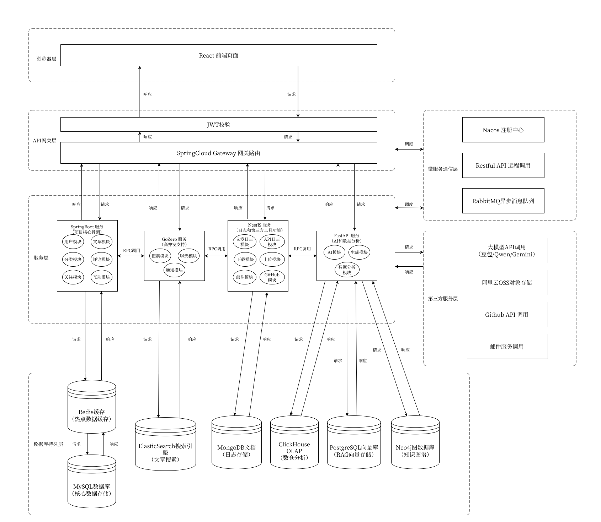
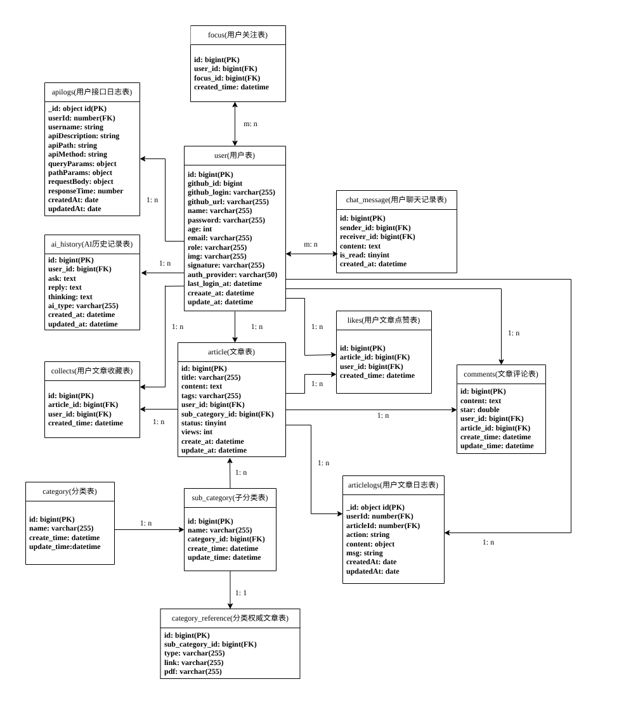

# 基于 RAG 知识问答与 LLM 驱动推荐的 IT 智能文章推荐与知识问答系统(多语言技术栈构建)


## 描述

这是一个基于多语言技术栈构建的 IT 智能文章推荐与知识问答系统，主要包含以下框架：

- Spring（Java）
- GoZero（Go）
- NestJS（Node.js）
- FastAPI（Python）

所有服务通过 SpringCloud Gateway 统一网关进行访问，实现了服务治理、认证授权等功能。

[前端对应仓库地址](https://gitee.com/chu-shichao/react-web-demo)

## 功能说明

1. 基于 Spring Boot 和 MybatisPlus 实现文章发布、修改等操作，文章的创建和显示都支持 Markdown
2. 基于 Spring Boot 和 MybatisPlus 实现用户、分类、评论、点赞、收藏、关注等业务模块
3. 基于 Spring Boot 和 Redis 进行文章分类，用户状态的管理操作
4. 基于 Spring Boot 和 AOP 技术权限校验实现用户端和管理端
5. 基于 GoZero 和 ElasticSearch 进行搜索引擎式文章搜索
6. 基于 GoZero 和 GORM 实现文章相关数据获取和同步
7. 基于 GoZero 和 WebSocket/SSE 实现用户实时聊天功能和消息通知
8. 基于 NestJS 和 Mongoose 进行文章操作日志和 API 日志的查看和分析
9. 基于 NestJS 和 TypeORM 实现文章下载的文章和用户数据获取
10. 基于 FastAPI 和 ClickHouse 技术栈实现系统数据的相关分析
11. 基于 FastAPI 和 SQLAlchemy 进行文章相关数据的获取和同步
12. 基于 FastAPI 和 LangChain 实现 RAG 文章检索增强和 Tools 调用 SQL 和 MongoDB，支持 **豆包/Gemini/Qwen** 进行多模型选择

## 设计图

- 系统架构图

  

- ER 图

  

## 技术栈

- Spring Boot：Java 后端框架，支撑系统核心业务服务
- GoZero：Golang 后端框架，支持系统高并发服务
- NestJS：Node.js 后端框架，支撑系统日志处理服务
- FastAPI：Python 后端服务，支撑系统数据分析和 Agent 服务
- Spring Cloud Gateway：API 网关
- JWT：身份验证
- Nacos：服务发现与配置中心
- MySQL：关系型数据库，系统核心数据库
- PostgreSQL：RAG 向量数据库
- MongoDB：非关系型数据库，系统日志数据库
- ElasticSearch：搜索引擎，系统搜索优化
- Redis：缓存服务和状态管理
- RabbitMQ：异步消息队列
- ClickHouse：大数据存储与分析
- WebSocket：用户实时聊天
- SSE：实时通知未读消息
- Langchain：大模型调用和 RAG 框架

## 第三方服务

- [火山引擎](https://www.volcengine.com/)
- [Google AI](https://aistudio.google.com/)
- [阿里云百炼平台](https://bailian.console.aliyun.com/)
- [Close AI](https://platform.closeai-asia.com/dashboard)
- [阿里云 OSS](https://oss.console.aliyun.com/overview)

## 环境要求

- Java 17+
- Maven 3.6+
- Gradle 9.3+(可选，但推荐用于 Java 项目构建)
- Go 1.23+
- Node.js 20+
- Bun 1.2+(可选)
- Python 3.12+
- uv 0.9+(可选)
- MySQL 8.0+
- PostgreSQL + pgvector 15.4+
- MongoDB 5.0+
- ElasticSearch 7.12.1+
- Redis 6.0+
- RabbitMQ 3.8+
- ClickHouse 21.8+(可选)

## 环境设置

> **提示**: 推荐使用 `setup.sh` 配置脚本自动完成以下所有安装步骤。
>
> 如果需要手动配置，可以按照下面的步骤逐个模块进行。

### Spring 部分

使用 Maven 构建

```bash
cd spring # 进入文件夹
cd gateway # 进入网关
mvn clean install # 下载依赖
```

使用 Gradle 构建（推荐）

> Gradle 不用依赖安装，运行时会自动下载依赖

```bash
cd spring
cd gateway
gradle wrapper          # 生成项目专用 Gradle（如果尚未生成）
```

### GoZero 部分

```bash
cd gozero/app # 进入文件夹
go mod tidy # 安装依赖
go install github.com/zeromicro/go-zero/tools/goctl@latest # 安装 goctl 代码生成工具
```

### NestJS 部分

```bash
cd nestjs # 进入文件夹
npm install # 安装npm包
bun install # 或者使用bun安装
```

### FastAPI 部分

使用标准 venv 和 requirements.txt

```bash
cd fastapi

# 创建虚拟环境
python3 -m venv venv

# 激活虚拟环境
source venv/bin/activate

# 安装依赖
pip install -r requirements.txt

# 运行项目
python main.py
```

使用 uv 进行项目管理

```bash
cd fastapi

# 安装 uv（如果未安装）
# 参考: https://docs.astral.sh/uv/getting-started/installation/

# 配置 uv 虚拟环境
uv venv --python /usr/bin/python3.11 # 创建虚拟环境时指定 Python

# 激活虚拟环境
source .venv/bin/activate

# 同步依赖（使用国内镜像）
uv sync

# 运行项目
uv run python main.py
```

> 项目使用 uv 进行依赖管理，配置文件为 `pyproject.toml`。镜像源配置在 `~/.config/uv/uv.toml`，内容如下

```toml
[[index]]
name = "aliyun"
url = "https://mirrors.aliyun.com/pypi/simple"
default = true

```

## 环境配置脚本

为了简化项目初始化过程，我们提供了自动化配置脚本 `scripts/setup.sh`，可以自动检测环境、安装依赖并配置所有模块。

### Linux/macOS 使用方式

```bash
# 1. 使用便捷脚本调用（推荐）
./mix setup

# 或直接调用
./scripts/setup.sh
```

### 交互式配置

运行脚本后会出现以下交互界面：

```bash
# 根据提示选择要配置的模块
# 选项:
# 1) Spring      - 配置 Spring Boot 服务
# 2) GoZero      - 配置 GoZero 服务
# 3) NestJS      - 配置 NestJS 服务
# 4) FastAPI     - 配置 FastAPI 服务
# 5) 全部        - 配置所有模块
```

### 脚本功能特性

1. **环境检查**
   - 自动检测 Python、Go、Java、Node.js 等必要工具的安装状态和版本
   - 如果缺少必要工具会给出明确提示

2. **系统依赖管理**（仅 FastAPI 模块需要）
   - 自动检测并安装 PostgreSQL 开发库（`libpq-dev`）
   - 自动安装编译工具（`build-essential`、`python3-dev`）
   - 支持多种 Linux 发行版（Ubuntu/Debian、CentOS/RHEL、Fedora、Arch）

3. **模块化安装**
   - 支持选择性安装特定模块或全部安装
   - 每个模块独立配置，互不影响

4. **智能判断**
   - Spring: 自动检测是否有全局 Gradle 和 Maven，优先使用 Gradle（若两者都存在）；同时安装两者的依赖以确保完整性
   - Gateway: 支持 Gradle 和 Maven 两种构建工具

- GoZero: 自动安装 goctl（API/ORM 代码生成工具、API-First 方式代码生成和 Swagger 文档生成工具）
- FastAPI: 自动安装 uv 并自动创建 uv 虚拟环境并使用阿里镜像源加速安装

5. **目录自动创建**

- 自动创建 logs 目录（spring、gozero、nestjs、fastapi）
- 自动创建 static 目录（pic、excel、word）

### 脚本执行流程

```bash
./mix setup
```

执行后将按以下流程进行：

1. **检测操作系统** - 识别当前 Linux 发行版
2. **检查环境** - 验证必要工具（Python、Go、Java、Node.js、npm）
3. **创建目录** - 自动创建日志和静态文件目录
4. **选择模块** - 交互式选择要配置的模块
5. **安装依赖** - 根据选择自动安装各模块依赖
6. **完成提示** - 显示后续配置步骤

### 注意事项

- **首次运行**: 建议首次配置时选择"全部"选项，确保所有依赖都正确安装
- **系统权限**: 安装系统依赖时可能需要 sudo 权限
- **网络要求**:
  - Go 模块需要访问 GitHub 和 Go 代理
  - Python 使用 uv 配置项目环境，使用阿里镜像源，国内访问速度较快
  - npm 使用默认源，建议配置国内镜像（如淘宝镜像）
- **虚拟环境**: FastAPI 会使用 uv 自动创建虚拟环境（venv），无需手动创建

### 配置完成后

脚本执行完成后，还需要：

1. **配置各服务的环境变量文件**（见下方"配置文件说明"章节，先参考 `.env.example` 生成本地 `.env`，Docker 则使用 `.env.docker`）
2. **启动基础服务**（MySQL、Redis、MongoDB、ElasticSearch、RabbitMQ、Nacos）
3. **使用运行脚本启动服务**（见"运行脚本配置"章节）

## Docker 容器环境管理

项目提供了 Docker 容器管理脚本，用于快速创建和管理所有依赖的容器服务。

### Docker 容器脚本用法

```bash
# 创建所有容器
./mix docker up

# 查看容器状态
./mix docker status

# 查看容器日志
./mix docker logs <service>

# 停止所有容器
./mix docker stop

# 删除所有容器
./mix docker delete

# 显示帮助信息
./mix docker help
```

### 创建的容器服务

脚本会自动创建以下 Docker 容器：

| 服务              | 端口  | 用户名   | 密码   | 说明                     |
| ----------------- | ----- | -------- | ------ | ------------------------ |
| **MySQL**         | 3306  | root     | 123    | 关系型数据库             |
| **PostgreSQL**    | 5432  | postgres | 123456 | 向量数据库(含 pgvector)  |
| **Redis**         | 6379  | -        | -      | 缓存服务                 |
| **MongoDB**       | 27017 | root     | 123456 | 非关系型数据库           |
| **ElasticSearch** | 9200  | -        | -      | 搜索引擎(7.12.1)         |
| **Nacos**         | 8848  | -        | -      | 服务发现与配置中心       |
| **RabbitMQ**      | 5672  | test     | 123456 | 消息队列(管理界面 15672) |

### 快速开始示例

```bash
# 第一次使用：创建所有容器
./mix docker up

# 查看所有容器是否正常运行
./mix docker status

# 查看 MySQL 容器的日志
./mix docker logs mysql

# 需要时停止容器
./mix docker stop

# 需要时删除容器
./mix docker delete
```

### 注意事项

- **首次创建**: 首次执行 `docker up` 时会创建 Docker 网络，可能需要一些时间
- **数据持久化**: 所有容器的数据都会持久化到宿主机目录
- **ElasticSearch**: 首次创建后会提示是否安装 IK 分词器（可选）
- **Nacos**: 自动生成 `nacos/custom.env` 配置文件，可根据需要修改
- **权限问题**: 如果遇到权限错误，可能需要使用 `sudo` 或将用户加入 docker 组
- 如果有额外创建的组件，按照个人的配置改动配置文件

## 编译和运行项目

> 每个服务都可以独立运行：

### Spring 服务（包括 gateway 网关）

**使用 Maven 运行**：

```bash
# 运行Spring服务
cd spring
mvn clean install # 构建项目
mvn spring-boot:run # 启动项目

# 运行网关服务
cd gateway
mvn clean install # 构建项目
mvn spring-boot:run # 启动项目
```

**使用 Gradle 运行（推荐）**：

```bash
# 运行Spring服务
cd spring
gradle bootRun # 启动项目

# 网关服务
cd gateway
gradle bootRun # 启动项目
```

### GoZero 服务

```bash
# 运行 GoZero 服务
cd gozero/app
go build -o bin/gozero main.go # 构建项目
go run main.go # 运行项目
```

### NestJS 服务

**使用 npm 运行**：

```bash
# 运行NestJS服务
cd nestjs
npm run node:start # npm development 模式运行
npm run node:start:dev # npm watch 模式运行
npm run node:start:debug # npm debug 模式运行
npm run node:start:prod # npm production 模式运行
```

**使用 npm 运行**：

```bash
cd nestjs
npm run bun:start # bun 运行
npm run bun:dev # bun watch 模式运行
npm run bun:prod # bun production 模式运行
```

### FastAPI 服务

**使用 venv 运行**：

```bash
# 运行FastAPI服务
cd fastapi
source venv/bin/activate # 激活虚拟环境
python main.py
```

**使用 uv 运行**：

```bash
# 运行FastAPI服务
cd fastapi
uv run python main.py

# 或指定 Python 版本
uv run --python 3.12 python main.py
```

## 运行脚本配置

所有运行脚本已组织到 `scripts/` 目录中，便于项目管理和维护。

### 快速启动（推荐）

#### Linux/macOS

```bash
# 查看帮助信息
./mix help

# ===== 开发环境 =====
# 使用多窗格 tmux 布局启动所有服务（推荐用于开发调试）
./mix multi

# 使用顺序窗口模式启动所有服务
./mix seq

# 停止所有 tmux 服务
./mix stop

# ===== Seq 模式下使用指定构建工具启动服务 =====
# 使用 Gradle 构建并启动 Java 服务（推荐，更快）
./mix seq --java-build gradle

# 使用 Maven 构建并启动 Java 服务
./mix seq --java-build maven

# 使用 Bun 启动 NestJS 服务（推荐，比 npm 快）
./mix seq --node-runtime bun

# 使用 npm 启动 NestJS 服务
./mix seq --node-runtime npm

# 使用 UV 启动 FastAPI 服务（推荐，比 python 快）
./mix seq --python-runtime uv

# 使用 Python 启动 FastAPI 服务
./mix seq --python-runtime python

# 交互式模式：让用户选择构建工具
./mix seq -i

# ===== GoZero 代码生成 =====
./mix goctl-api
./mix goctl-orm

# ===== Docker 容器环境 =====
# 构建并启动所有微服务容器
./mix docker up

# 构建并启动特定服务容器
./mix docker up spring gozero

# 仅构建镜像
./mix docker build

# 查看容器状态
./mix docker status

# 查看容器日志
./mix docker logs spring

# 停止所有容器
./mix docker stop

# ===== 生产环境 =====
# 构建所有服务到 dist/ 目录
./mix build

# 启动所有已构建的服务（后台运行）
./mix start

# 启动指定的服务
./mix start spring gateway
./mix start fastapi gozero

# 查看已构建服务的运行状态
./mix status

# 查看指定服务的运行状态
./mix status spring gozero

# 重启所有已构建的服务
./mix restart

# 重启指定的服务
./mix restart fastapi
./mix restart spring gateway nestjs

# 停止所有已构建的服务
./mix stop-dist

# 停止指定的服务
./mix stop-dist spring fastapi

# 查看服务的最新日志（只支持查看单个服务）
./mix logs spring
./mix logs fastapi
./mix logs gozero
```

**构建工具参数说明**：

- `--java-build gradle|maven`：选择 Java 构建工具（Spring/Gateway）
  - `gradle`：使用 Gradle（推荐，更快）
  - `maven`：使用 Maven（可选）
  - 默认值：`gradle`（如果已安装）

- `--node-runtime bun|npm`：选择 Node.js 运行时（NestJS）
  - `bun`：使用 Bun（推荐，比 npm 快 4-8 倍）
  - `npm`：使用 npm（可选）
  - 默认值：`bun`（如果已安装）

- `--python-runtime uv|python`：选择 Python 运行时（FastAPI）
  - `uv`：使用 UV（推荐，更快且支持虚拟环境）
  - `python`：使用原生 Python（可选）
  - 默认值：`uv`（如果已安装）

- `-i`/`--interactive`：交互式模式，让用户选择每个服务的工具

#### Windows

```powershell
# 启动所有服务（PowerShell）
PowerShell -ExecutionPolicy Bypass -File .\scripts\run.ps1
```

### 直接调用脚本

如果需要直接调用 `scripts/` 目录下的脚本：

#### Linux/macOS

```bash
# 启动服务（多窗格布局） - 使用 Gradle 构建
./scripts/run_multi.sh

# 或指定构建工具参数（推荐）
./scripts/run.sh --java-build gradle --node-runtime bun --python-runtime uv

# 启动服务（顺序窗口布局）
./scripts/run.sh

# 交互式选择工具
./scripts/run.sh -i

# 停止所有服务
./scripts/stop.sh

# 构建所有服务
./scripts/build.sh

# 管理分布式部署的服务

# 启动所有服务或指定服务
./scripts/dist-control.sh start              # 启动所有
./scripts/dist-control.sh start spring gozero   # 启动指定

# GoZero 代码生成
./scripts/goctl-api-init.sh
./scripts/goctl-orm-init.sh

# 停止所有服务或指定服务
./scripts/dist-control.sh stop               # 停止所有
./scripts/dist-control.sh stop fastapi       # 停止指定

# 查看所有服务状态或指定服务状态
./scripts/dist-control.sh status             # 查看所有
./scripts/dist-control.sh status spring      # 查看指定

# 重启所有服务或指定服务
./scripts/dist-control.sh restart            # 重启所有
./scripts/dist-control.sh restart nestjs     # 重启指定

# 查看单个服务的最新日志
./scripts/dist-control.sh logs spring
./scripts/dist-control.sh logs fastapi
```

**run.sh 脚本参数**：

| 参数                   | 选项               | 说明                                             |
| ---------------------- | ------------------ | ------------------------------------------------ |
| `--java-build`         | `gradle` / `maven` | Java 项目构建工具（Spring/Gateway），默认 gradle |
| `--node-runtime`       | `bun` / `npm`      | Node.js 运行时（NestJS），默认 bun               |
| `--python-runtime`     | `uv` / `python`    | Python 运行时（FastAPI），默认 uv                |
| `-i` / `--interactive` | 无                 | 交互式模式，提示用户选择各服务的工具             |
| `-h` / `--help`        | 无                 | 显示帮助信息                                     |

示例：

```bash
# 使用 Maven 和 npm 启动
./scripts/run.sh --java-build maven --node-runtime npm

# 使用 Python 启动 FastAPI
./scripts/run.sh --python-runtime python

# 交互式选择
./scripts/run.sh --interactive
```

#### Windows

```powershell
# 启动所有服务
.\scripts\run.ps1
```

### 脚本说明

| 脚本                | 位置       | 功能                                       | 适用系统    |
| ------------------- | ---------- | ------------------------------------------ | ----------- |
| `mix`               | 项目根目录 | 便捷启动器，用于快速调用 scripts/ 下的脚本 | Linux/macOS |
| `run_multi.sh`      | scripts/   | 使用 tmux 多窗格布局启动所有服务（推荐）   | Linux/macOS |
| `run.sh`            | scripts/   | 使用 tmux 顺序窗口模式启动所有服务         | Linux/macOS |
| `stop.sh`           | scripts/   | 停止所有 tmux 服务                         | Linux/macOS |
| `build.sh`          | scripts/   | 编译所有服务到 dist/ 目录                  | Linux/macOS |
| `dist-control.sh`   | scripts/   | 管理打包后的分布式服务（支持服务指定）     | Linux/macOS |
| `setup.sh`          | scripts/   | 环境初始化和依赖安装                       | Linux/macOS |
| `swag-init.sh`      | scripts/   | 生成 GoZero Swagger 文档                   | Linux/macOS |
| `goctl-api-init.sh` | scripts/   | 生成 GoZero API 代码                       | Linux/macOS |
| `goctl-orm-init.sh` | scripts/   | 生成 GoZero ORM 代码                       | Linux/macOS |
| `run.ps1`           | scripts/   | PowerShell 脚本，启动所有服务              | Windows     |

### 服务名称

dist-control.sh 和 mix 支持以下服务名称：

- `spring` - Spring Boot 服务
- `gateway` - Spring Cloud Gateway 网关服务
- `fastapi` - FastAPI 服务
- `gozero` - GoZero 服务
- `nestjs` - NestJS 服务

如不指定服务名称，则对所有服务进行操作。

### 注意事项

1. **tmux 依赖**：Linux/macOS 脚本依赖 `tmux`，请确保已安装
2. **执行权限**：Linux/macOS 脚本需要执行权限，可以通过 `chmod +x scripts/*.sh` 来设置
3. **相对路径**：所有脚本都使用相对路径，可以在任何目录下调用项目的脚本
4. **服务依赖**：启动前请确保 MySQL、Redis、MongoDB、ElasticSearch、RabbitMQ、Nacos 等基础服务已运行
5. **logs 命令**：仅支持查看单个服务的日志，如需查看多个服务请依次调用

## 生产环境部署

本项目提供了统一的打包和部署脚本，可以一键打包所有微服务并统一管理。

**快速打包和部署（方法一：使用便捷脚本）：**

```bash
# 1. 一键打包所有服务
./mix build

# 2. 启动所有服务
./mix start

# 3. 查看服务状态
./mix status

# 4. 重启所有服务（代码更新后）
./mix restart

# 5. 停止所有服务
./mix stop-dist
```

**快速打包和部署（方法二：直接调用脚本）：**

```bash
# 1. 一键打包所有服务
./scripts/build.sh

# 2. 启动所有服务
./scripts/dist-control.sh start

# 3. 查看服务状态
./scripts/dist-control.sh status

# 4. 重启所有服务
./scripts/dist-control.sh restart

# 5. 停止所有服务
./scripts/dist-control.sh stop
```

打包后的文件统一位于 `dist/` 目录，每个服务都包含配置文件、启动/停止脚本和日志文件。

### 脚本说明

- **mix**（项目根目录）
  - 便捷启动器，用于快速调用 `scripts/` 下的脚本
  - 支持开发环境和生产环境命令

- **scripts/build.sh**
  - 编译所有服务：Spring、Gateway、FastAPI、GoZero、NestJS
  - 将编译结果打包到 `dist/` 目录
  - 包含编译错误检查和日志输出

- **scripts/dist-control.sh**
  - 管理打包后的分布式服务
  - 支持的操作：`start`、`stop`、`status`、`restart`、`logs`

**示例用法：**

```bash
# 第一次部署
./mix build
./mix start

# 查看运行状态
./mix status

# 代码更新后重新部署
./mix build
./mix restart

# 停止所有服务
./mix stop-dist
```

## Docker 容器部署

项目提供了完整的 Docker 支持，可以为每个微服务构建镜像并创建容器。

### 微服务 Docker 快速开始

```bash
# 1. 构建并启动所有微服务容器
./mix docker up

# 2. 查看容器状态
./mix docker status

# 3. 查看特定服务的日志
./mix docker logs spring

# 4. 停止所有微服务容器
./mix docker stop
```

Docker 环境会优先读取每个服务目录下的 `.env.docker`，不会自动创建该文件。请根据需要手动准备 Docker 专用环境变量文件，本地开发仍然使用 `.env`。

### 微服务容器说明

| 服务        | 端口 | 镜像名称             | 容器名称                | 技术栈           |
| ----------- | ---- | -------------------- | ----------------------- | ---------------- |
| **Gateway** | 8080 | `mix-gateway:latest` | `mix-gateway-container` | Java 17 + Alpine |
| **Spring**  | 8081 | `mix-spring:latest`  | `mix-spring-container`  | Java 17 + Alpine |
| **GoZero**  | 8082 | `mix-gozero:latest`  | `mix-gozero-container`  | Go 1.23 + Alpine |
| **NestJS**  | 8083 | `mix-nestjs:latest`  | `mix-nestjs-container`  | Node 20 + Alpine |
| **FastAPI** | 8084 | `mix-fastapi:latest` | `mix-fastapi-container` | Python 3.12      |

### 高级用法

```bash
# 仅构建特定服务的镜像
./mix docker build spring gozero

# 仅构建镜像，不启动容器
./scripts/build_and_run_services.sh --build-only

# 手动启动容器时指定配置文件
docker run -d --name mix-spring-custom \
  -p 8081:8081 \
  -v $(pwd)/spring/application.yaml:/app/application.yaml \
  -v $(pwd)/spring/application-secret.yaml:/app/application-secret.yaml \
  mix-spring:latest

# 查看容器日志
docker logs -f mix-spring-container

# 进入容器交互式终端
docker exec -it mix-spring-container bash

# 重启容器（应用新配置）
docker restart mix-spring-container
```

## Kubernetes 集群部署

### 前置要求

部署到 Kubernetes 集群需要以下工具：

- **kubectl**：Kubernetes 命令行工具（>=1.24）
- **Minikube** (本地开发) 或其他 K8s 集群
- **Docker**：用于构建容器镜像

### 工具安装

本项目提供了自动化的 K8s 工具安装脚本：

```bash
# 安装所有必要工具（kubectl + Docker + Minikube）
./scripts/install-k8s-tools.sh all

# 仅安装kubectl
./scripts/install-k8s-tools.sh kubectl

# 仅安装Minikube
./scripts/install-k8s-tools.sh minikube

# 启动Minikube集群
./scripts/install-k8s-tools.sh start-cluster
```

或使用 `mix` 便捷脚本：

```bash
# 查看K8s相关命令
./mix k8s help

# 安装/检查K8s工具
./mix k8s install
```

### 本地开发环境（Minikube）

```bash
# 1. 启动Minikube集群（首次使用）
minikube start --driver=docker

# 2. 构建Docker镜像
./mix docker build

# 3. 加载镜像到Minikube
eval $(minikube docker-env)
./mix docker build

# 或手动加载：
minikube image load mix-spring:latest
minikube image load mix-gateway:latest
minikube image load mix-fastapi:latest
minikube image load mix-gozero:latest
minikube image load mix-nestjs:latest
```

### K8s 部署快速开始

```bash
# 1. 查看可用命令
./mix k8s help

# 2. 部署所有服务到K8s集群
./mix k8s deploy

# 3. 查看部署状态
./mix k8s status

# 4. 查看pod日志
./mix k8s logs spring
./mix k8s logs gozero
./mix k8s logs nestjs
./mix k8s logs fastapi
./mix k8s logs gateway

# 5. 端口转发（本地访问）
./mix k8s port-forward spring 8081
./mix k8s port-forward gateway 8080

# 6. 进入Pod交互式终端
./mix k8s exec spring
./mix k8s exec gateway

# 7. 滚动重启服务（应用新配置）
./mix k8s restart spring
./mix k8s restart gateway

# 8. 删除所有K8s资源
./mix k8s delete
```

### K8s 资源说明

项目提供的 K8s 资源文件位于 `k8s/` 目录：

| 文件              | 说明               | 资源类型                          |
| ----------------- | ------------------ | --------------------------------- |
| `namespace.yaml`  | 命名空间和网络策略 | Namespace, NetworkPolicy          |
| `configmap.yaml`  | 服务配置管理       | ConfigMap (5 个)                  |
| `deployment.yaml` | 服务部署和内部服务 | Deployment (5 个), Service (5 个) |
| `ingress.yaml`    | 外部访问入口       | Ingress                           |

**部署配置：**

- **副本数**: 2 (可根据负载调整)
- **资源限制**:
  - Go/Node 服务: 256Mi 内存, 100m CPU
  - Java 服务: 512Mi 内存, 200m CPU
  - Python 服务: 256Mi 内存, 100m CPU
- **健康检查**: 所有 Pod 都包含存活探针(livenessProbe)和就绪探针(readinessProbe)

### 访问服务

**通过 kubectl port-forward：**

```bash
# 转发网关到本地 9000 端口
kubectl port-forward -n mix-web-demo svc/gateway 9000:9000

# 然后访问: http://localhost:9000
```

**通过 Ingress（集群内）：**

```bash
# 获取 Ingress 地址
kubectl get ingress -n mix-web-demo

# 然后访问相应的路由
http://<ingress-ip>/        # Gateway
http://<ingress-ip>/gozero  # GoZero服务
http://<ingress-ip>/nestjs  # NestJS服务
http://<ingress-ip>/spring  # Spring服务
http://<ingress-ip>/fastapi # FastAPI服务
```

### 高级用法

```bash
# 查看详细的服务信息
./mix k8s describe spring

# 监控部署进度
./mix k8s rollout-status gateway

# 直接调用k8s-deploy.sh获取更多选项
./scripts/k8s-deploy.sh help

# 手动应用K8s清单文件
kubectl apply -f k8s/namespace.yaml
kubectl apply -f k8s/configmap.yaml
kubectl apply -f k8s/deployment.yaml
kubectl apply -f k8s/ingress.yaml

# 查看集群中的所有资源
kubectl get all -n mix-web-demo

# 查看Pod的详细信息
kubectl describe pod <pod-name> -n mix-web-demo

# 查看服务的端点
kubectl get endpoints -n mix-web-demo
```

### 故障排查

```bash
# 检查Pod状态
kubectl get pods -n mix-web-demo

# 查看Pod详细信息
kubectl describe pod <pod-name> -n mix-web-demo

# 查看Pod日志
kubectl logs <pod-name> -n mix-web-demo

# 查看事件日志
kubectl get events -n mix-web-demo --sort-by='.lastTimestamp'

# 进入Pod容器
kubectl exec -it <pod-name> -n mix-web-demo -- /bin/bash

# 检查资源使用情况
kubectl top nodes
kubectl top pods -n mix-web-demo

# 检查ConfigMap是否正确挂载
kubectl get configmap -n mix-web-demo
kubectl describe configmap <config-name> -n mix-web-demo
```

## 基础服务组件初始化

### 确保已安装并启动以下数据库服务：

- MySQL
- PostgreSQL
  - 需要安装 `pgvector`插件
- MongoDB
- Redis
- ElasticSearch
- RabbitMQ
- Nacos

### MySQL 表创建(可选，代码会自动创建)

- 在配置文件中指定对应的数据库
- 创建用户表

```sql
CREATE TABLE user (
    id BIGINT PRIMARY KEY AUTO_INCREMENT COMMENT '用户ID',
    name VARCHAR(255) NOT NULL UNIQUE COMMENT '用户名',
    password VARCHAR(255) NOT NULL COMMENT '密码',
    email VARCHAR(255) UNIQUE COMMENT '邮箱',
    age INT COMMENT '年龄',
    role VARCHAR(255) NOT NULL COMMENT '用户权限',
    img VARCHAR(255) COMMENT '用户头像',
    signature VARCHAR(255) COMMENT '个性签名'
) COMMENT='用户表'
```

- 创建文章表

```sql
CREATE TABLE articles (
    id BIGINT PRIMARY KEY AUTO_INCREMENT COMMENT '文章id',
    title VARCHAR(255) NOT NULL COMMENT '文章标题',
    content LONGTEXT NOT NULL COMMENT '文章内容',
    user_id BIGINT NOT NULL COMMENT '用户id',
    sub_category_id BIGINT NOT NULL COMMENT '子分类id',
    tags VARCHAR(255) NOT NULL COMMENT '文章标签',
    status TINYINT NOT NULL COMMENT '文章状态',
    views INT NOT NULL COMMENT '文章浏览量',
    create_at DATETIME DEFAULT CURRENT_TIMESTAMP COMMENT '创建时间',
    update_at DATETIME DEFAULT CURRENT_TIMESTAMP ON UPDATE CURRENT_TIMESTAMP COMMENT '更新时间'
) COMMENT='文章表'
```

- 创建分类表

```sql
CREATE TABLE category (
    id BIGINT PRIMARY KEY AUTO_INCREMENT COMMENT '主键',
    name VARCHAR(255) NOT NULL COMMENT '分类名称',
    create_time DATETIME DEFAULT CURRENT_TIMESTAMP COMMENT '创建时间',
    update_time DATETIME DEFAULT CURRENT_TIMESTAMP ON UPDATE CURRENT_TIMESTAMP COMMENT '更新时间'
) COMMENT='分类表';
```

- 创建子分类表

```sql
CREATE TABLE sub_category (
    id BIGINT PRIMARY KEY AUTO_INCREMENT COMMENT '主键',
    name VARCHAR(255) NOT NULL COMMENT '子分类名称',
    category_id BIGINT NOT NULL COMMENT '所属分类ID',
    create_time DATETIME DEFAULT CURRENT_TIMESTAMP COMMENT '创建时间',
    update_time DATETIME DEFAULT CURRENT_TIMESTAMP ON UPDATE CURRENT_TIMESTAMP COMMENT '更新时间',
    FOREIGN KEY (category_id) REFERENCES category(id) ON DELETE CASCADE
) COMMENT='子分类表';
```

- 创建权威参考文本表

```sql
CREATE TABLE category_reference (
    id BIGINT PRIMARY KEY AUTO_INCREMENT COMMENT '主键',
    sub_category_id BIGINT NOT NULL COMMENT '子分类ID',
    type VARCHAR(255) NOT NULL COMMENT '权威参考文本类型，link/pdf',
    link VARCHAR(255) COMMENT '权威参考文本链接',
    pdf VARCHAR(255) COMMENT '权威参考文本PDF链接（OSS）',
    UNIQUE KEY uk_sub_category (sub_category_id),
    FOREIGN KEY (sub_category_id) REFERENCES sub_category(id) ON DELETE CASCADE
) COMMENT='分类权威参考文本表';
```

- 创建用户聊天历史记录表

```sql
CREATE TABLE `chat_messages` (
    `id` BIGINT UNSIGNED NOT NULL AUTO_INCREMENT COMMENT '消息ID，主键',
    `sender_id` VARCHAR(50) NOT NULL COMMENT '发送者ID',
    `receiver_id` VARCHAR(50) NOT NULL COMMENT '接收者ID',
    `content` TEXT NOT NULL COMMENT '消息内容',
    `is_read` TINYINT NOT NULL DEFAULT 0 COMMENT '是否已读，0未读，1已读',
    `created_at` DATETIME(3) DEFAULT CURRENT_TIMESTAMP(3) COMMENT '创建时间',
    PRIMARY KEY (`id`),
    KEY `idx_sender_receiver` (`sender_id`, `receiver_id`)
) ENGINE=InnoDB DEFAULT CHARSET=utf8mb4 COLLATE=utf8mb4_unicode_ci COMMENT='聊天消息表';
```

- 创建文章评论表

```sql
CREATE TABLE comments (
    id BIGINT NOT NULL PRIMARY KEY AUTO_INCREMENT COMMENT 'Primary Key',
    content TEXT COMMENT '评论内容',
    star DOUBLE COMMENT '星级评分，0~10',
    user_id BIGINT NOT NULL COMMENT '用户 ID',
    article_id BIGINT NOT NULL COMMENT '文章 ID',
    create_time DATETIME DEFAULT CURRENT_TIMESTAMP COMMENT 'Create Time',
    update_time DATETIME DEFAULT CURRENT_TIMESTAMP ON UPDATE CURRENT_TIMESTAMP COMMENT 'Update Time'
) COMMENT '文章评论表';
```

- 创建 AI 聊天历史记录

```sql
CREATE TABLE `ai_history` (
    `id` BIGINT NOT NULL AUTO_INCREMENT,
    `user_id` BIGINT NOT NULL,
    `ask` TEXT NOT NULL,
    `reply` TEXT NOT NULL,
    `thinking` TEXT,
    `ai_type` VARCHAR(30),
    `created_at` DATETIME DEFAULT CURRENT_TIMESTAMP,
    `updated_at` DATETIME DEFAULT CURRENT_TIMESTAMP ON UPDATE CURRENT_TIMESTAMP,
    PRIMARY KEY (`id`)
) COMMENT 'AI聊天记录';
```

- 创建文章用户点赞表

```sql
CREATE TABLE IF NOT EXISTS likes (
    id BIGINT PRIMARY KEY AUTO_INCREMENT COMMENT '主键',
    article_id BIGINT NOT NULL COMMENT '文章ID',
    user_id BIGINT NOT NULL COMMENT '用户ID',
    created_time TIMESTAMP DEFAULT CURRENT_TIMESTAMP COMMENT '创建时间',
    UNIQUE KEY uk_article_user (article_id, user_id),
    KEY idx_user_id (user_id),
    KEY idx_created_time (created_time)
) ENGINE = InnoDB DEFAULT CHARSET = utf8mb4 COLLATE = utf8mb4_unicode_ci COMMENT = '文章用户点赞表';
```

- 创建文章收藏表

```sql
CREATE TABLE IF NOT EXISTS collects (
    id BIGINT PRIMARY KEY AUTO_INCREMENT COMMENT '主键',
    article_id BIGINT NOT NULL COMMENT '文章ID',
    user_id BIGINT NOT NULL COMMENT '用户ID',
    created_time TIMESTAMP DEFAULT CURRENT_TIMESTAMP COMMENT '创建时间',
    UNIQUE KEY uk_article_user (article_id, user_id),
    KEY idx_user_id (user_id),
    KEY idx_created_time (created_time)
) ENGINE = InnoDB DEFAULT CHARSET = utf8mb4 COLLATE = utf8mb4_unicode_ci COMMENT = '文章用户收藏表';
```

- 创建用户关注表

```sql
CREATE TABLE IF NOT EXISTS focus (
    id BIGINT PRIMARY KEY AUTO_INCREMENT COMMENT '主键',
    user_id BIGINT NOT NULL COMMENT '用户ID',
    focus_id BIGINT NOT NULL COMMENT '关注的用户ID',
    created_time TIMESTAMP DEFAULT CURRENT_TIMESTAMP COMMENT '创建时间',
    UNIQUE KEY uk_user_focus (user_id, focus_id),
    KEY idx_user_id (user_id),
    KEY idx_created_time (created_time)
) ENGINE = InnoDB DEFAULT CHARSET = utf8mb4 COLLATE = utf8mb4_unicode_ci COMMENT = '关注表';
```

### PostgreSQL 表创建

LangChain 会自动创建，但是需要启用 pgvector 扩展

```pgsql
-- 启用 pgvector 扩展
CREATE EXTENSION IF NOT EXISTS vector;
```

### MongoDB 表创建

- 数据库为 `demo`，集合为 `articlelogs`和 `apilogs`，系统会自动创建

### ElasticSearch 索引创建

- 无需创建，系统同步数据时会自动创建

### ClickHouse 创建

- 需要创建创建MySQL映射库，并创建对应文章表本地视图

```sql
-- 1. 创建映射库 (填入你的实际 MySQL 密码)
CREATE DATABASE demo ENGINE = MySQL (
    '127.0.0.1:3306',
    'demo',
    'root',
    '123456'
);

-- 2. 创建本地物理表 (对应你图片中的字段)
CREATE TABLE articles (
    id Int64,
    title String,
    content String,
    user_id Int64,
    sub_category_id Int64,
    tags String,
    status Int8,
    views Int32,
    create_at DateTime,
    update_at DateTime
) ENGINE = MergeTree ()
ORDER BY id;
-- 以 ID 排序，方便快速查找

-- 3. 创建物化视图，定期从 MySQL 同步数据到 ClickHouse
CREATE MATERIALIZED VIEW articles_sync_view REFRESH EVERY 10 SECOND -- 10 秒
TO default.articles AS
SELECT *
FROM demo.articles;
```

## 环境变量配置文件

本项目按环境拆分配置文件：

- `.env.example`：示例文件，保留全部变量名，用于复制生成本地配置
- `.env`：本地开发使用的真实配置文件，不建议提交敏感值
- `.env.docker`：Docker 容器使用的环境变量文件，脚本会在容器启动时读取它

所有配置值通过 `${VAR_NAME:default_value}` 的格式在 YAML 文件中引用。

### Spring 服务配置

**文件位置**: `spring/.env`

**示例文件**: `spring/.env.example`

**Docker 文件**: `spring/.env.docker`

```dotenv
# Spring 服务配置
SERVER_ADDRESS=0.0.0.0
SERVER_PORT=8081

# Tomcat 配置
TOMCAT_THREADS_MAX=25
TOMCAT_ACCEPT_COUNT=25
TOMCAT_MAX_CONNECTIONS=100

# MySQL 配置
DB_HOST=localhost
DB_PORT=3306
DB_NAME=demo
DB_USERNAME=root
DB_PASSWORD=csc20040312

# MySQL HikariCP 连接池配置
DB_POOL_MAX=20
DB_POOL_MIN_IDLE=5
DB_POOL_TIMEOUT=30000
DB_POOL_IDLE_TIMEOUT=600000
DB_POOL_MAX_LIFETIME=1800000
DB_POOL_LEAK_DETECTION_THRESHOLD=60000

# Redis 配置
REDIS_HOST=localhost
REDIS_PORT=6379
REDIS_DATABASE=0
# REDIS_USERNAME=
# REDIS_PASSWORD=
REDIS_POOL_MAX_ACTIVE=10
REDIS_POOL_MAX_IDLE=5
REDIS_POOL_MIN_IDLE=1
REDIS_TIMEOUT=3000

# RabbitMQ 配置
RABBITMQ_HOST=127.0.0.1
RABBITMQ_PORT=5672
RABBITMQ_USERNAME=hcsy
RABBITMQ_PASSWORD=123456
RABBITMQ_VHOST=test

# 邮件配置
MAIL_HOST=smtp.qq.com
MAIL_PORT=465
MAIL_USERNAME=your-email@qq.com
MAIL_PASSWORD=your-email-password

# 日志配置
LOGGING_PATH=../logs/spring

# JWT 配置
JWT_SECRET=xxx
JWT_EXPIRATION=86400000

# Nacos 配置
NACOS_SERVER=127.0.0.1:8848
NACOS_NAMESPACE=public
NACOS_GROUP_NAME=DEFAULT_GROUP

# 内部服务令牌配置
INTERNAL_TOKEN_SECRET=xxx
INTERNAL_TOKEN_EXPIRATION=60000
```

### GoZero 服务配置

**文件位置**: `gozero/app/.env`

**示例文件**: `gozero/app/.env.example`

**Docker 文件**: `gozero/app/.env.docker`

```dotenv
# gozero 服务配置
SERVER_NAME=gozero
SERVER_IP=127.0.0.1
SERVER_PORT=8082
SERVER_PREFIX=/
SERVER_TIMEOUT=0

# Nacos 配置
NACOS_IP=127.0.0.1
NACOS_PORT=8848
NACOS_NAMESPACE=public
NACOS_SERVICE_NAME=gozero
NACOS_GROUP_NAME=DEFAULT_GROUP
NACOS_CLUSTER_NAME=DEFAULT
NACOS_CACHE_DIR=../../static/tmp/nacos/cache
NACOS_LOG_DIR=../../static/tmp/nacos/log

# MySQL 配置
DB_MYSQL_HOST=127.0.0.1
DB_MYSQL_PORT=3306
DB_MYSQL_USERNAME=root
DB_MYSQL_PASSWORD=csc20040312
DB_MYSQL_DBNAME=demo
DB_MYSQL_CHARSET=utf8mb4
DB_MYSQL_LOC=Local

# ElasticSearch 配置
DB_ES_HOST=127.0.0.1
DB_ES_PORT=9200
# DB_ES_USERNAME=
# DB_ES_PASSWORD=
DB_ES_SNIFF=false

# MongoDB 配置
DB_MONGODB_HOST=127.0.0.1
DB_MONGODB_PORT=27017
# DB_MONGODB_USERNAME=
# DB_MONGODB_PASSWORD=
DB_MONGODB_DATABASE=demo

# RabbitMQ 配置
RABBITMQ_USERNAME=hcsy
RABBITMQ_PASSWORD=123456
RABBITMQ_HOST=127.0.0.1
RABBITMQ_PORT=5672
RABBITMQ_VHOST=test

# 日志配置
LOGS_PATH=../../logs/gozero

# 搜索配置
SEARCH_ES_SCORE_WEIGHT=0.25
SEARCH_AI_RATING_WEIGHT=0.15
SEARCH_USER_RATING_WEIGHT=0.10
SEARCH_VIEWS_WEIGHT=0.08
SEARCH_LIKES_WEIGHT=0.08
SEARCH_COLLECTS_WEIGHT=0.08
SEARCH_AUTHOR_FOLLOW_WEIGHT=0.04
SEARCH_RECENCY_WEIGHT=0.22
SEARCH_MAX_VIEWS_NORMALIZED=10000.0
SEARCH_MAX_LIKES_NORMALIZED=1000.0
SEARCH_MAX_COLLECTS_NORMALIZED=1000.0
SEARCH_MAX_FOLLOWS_NORMALIZED=5000.0
SEARCH_RECENCY_DECAY_DAYS=30

# 内部服务令牌配置
INTERNAL_TOKEN_SECRET=xxx
INTERNAL_TOKEN_EXPIRATION=60000
```

### NestJS 服务配置

**文件位置**: `nestjs/.env`

**示例文件**: `nestjs/.env.example`

**Docker 文件**: `nestjs/.env.docker`

```dotenv
# NestJS 服务配置
SERVER_IP=127.0.0.1
SERVER_PORT=8083
SERVER_SERVICE_NAME=nestjs

# Nacos 配置
NACOS_SERVER=127.0.0.1
NACOS_NAMESPACE=public
NACOS_CLUSTER_NAME=DEFAULT

# MySQL 配置
DB_TYPE=mysql
DB_HOST=localhost
DB_PORT=3306
DB_USERNAME=root
DB_PASSWORD=csc20040312
DB_DATABASE=demo
DB_SYNCHRONIZE=false
DB_LOGGING=false

# MongoDB 配置
DB_MONGODB_HOST=localhost
DB_MONGODB_PORT=27017
# DB_MONGODB_USERNAME=
# DB_MONGODB_PASSWORD=
DB_MONGODB_DATABASE=demo

# RabbitMQ 配置
RABBITMQ_HOST=localhost
RABBITMQ_PORT=5672
RABBITMQ_USERNAME=hcsy
RABBITMQ_PASSWORD=123456
RABBITMQ_VHOST=test

# 文件配置
FILES_WORD_PATH=../static/word
FILES_UPLOAD_PATH=../static/upload

# 日志配置
LOGS_PATH=../logs/nestjs

# 内部服务令牌配置
INTERNAL_TOKEN_SECRET=xxx
INTERNAL_TOKEN_EXPIRATION=60000

# OSS 配置
OSS_BUCKET_NAME=mix-web-demo
OSS_ENDPOINT=oss-cn-guangzhou.aliyuncs.com
OSS_ACCESS_KEY_ID=your-key-id
OSS_ACCESS_KEY_SECRET=your-key-secret
```

### FastAPI 服务配置

**文件位置**: `fastapi/.env`

**示例文件**: `fastapi/.env.example`

**Docker 文件**: `fastapi/.env.docker`

```dotenv
# FastAPI 服务配置
SERVER_IP=127.0.0.1
SERVER_PORT=8084
SERVER_RELOAD=True

# Nacos 配置
NACOS_SERVER=127.0.0.1:8848
NACOS_NAMESPACE=public
NACOS_SERVICE_NAME=fastapi
NACOS_GROUP_NAME=DEFAULT_GROUP

# RabbitMQ 配置
RABBITMQ_HOST=127.0.0.1
RABBITMQ_PORT=5672
RABBITMQ_USERNAME=hcsy
RABBITMQ_PASSWORD=123456
RABBITMQ_VHOST=test

# MySQL 配置
DB_MYSQL_HOST=localhost
DB_MYSQL_PORT=3306
DB_MYSQL_DATABASE=demo
DB_MYSQL_USER=root
DB_MYSQL_PASSWORD=csc20040312
# 基础连接池大小
DB_MYSQL_POOL_SIZE=30
# 最多额外创建的连接数
DB_MYSQL_MAX_OVERFLOW=80
# 连接回收时间（秒），1小时回收一次
DB_MYSQL_POOL_RECYCLE=3600
# 每次取连接前进行ping检查
DB_MYSQL_POOL_PRE_PING=True
# 获取连接的超时时间（秒）
DB_MYSQL_POOL_TIMEOUT=30
# pymysql读超时（秒）
DB_MYSQL_READ_TIMEOUT=10
# pymysql写超时（秒）
DB_MYSQL_WRITE_TIMEOUT=10
# 自动提交事务
DB_MYSQL_AUTOCOMMIT=False
# 是否打印SQL语句到日志
DB_MYSQL_ECHO=False

# PostgreSQL 配置
DB_POSTGRES_HOST=localhost
DB_POSTGRES_PORT=5432
DB_POSTGRES_DATABASE=demo
DB_POSTGRES_USER=postgres
DB_POSTGRES_PASSWORD=123456
DB_POSTGRES_POOL_PRE_PING=True
DB_POSTGRES_POOL_SIZE=10
DB_POSTGRES_MAX_OVERFLOW=20
DB_POSTGRES_ECHO=False

# MongoDB 配置
DB_MONGODB_HOST=localhost
DB_MONGODB_PORT=27017
# DB_MONGODB_USERNAME=
# DB_MONGODB_PASSWORD=
DB_MONGODB_DATABASE=demo

# ClickHouse 配置
DB_CLICKHOUSE_HOST=127.0.0.1
DB_CLICKHOUSE_PORT=9002
DB_CLICKHOUSE_USERNAME=hcsy
DB_CLICKHOUSE_PASSWORD=123456
DB_CLICKHOUSE_DATABASE=default
DB_CLICKHOUSE_TABLE=articles

# Redis 配置
DB_REDIS_HOST=127.0.0.1
DB_REDIS_PORT=6379
# DB_REDIS_USERNAME=default
# DB_REDIS_PASSWORD=
DB_REDIS_DB=0
DB_REDIS_DECODE_RESPONSES=True
DB_REDIS_MAX_CONNECTIONS=10

# WordCloud 配置
WORDCLOUD_FONT_PATH=/usr/share/fonts/opentype/noto/NotoSansCJK-Regular.ttc
WORDCLOUD_WIDTH=800
WORDCLOUD_HEIGHT=400
WORDCLOUD_BG_COLOR=white

# 文件配置
FILES_PIC_PATH=../static/pic
FILES_EXCEL_PATH=../static/excel

# 日志配置
LOGS_PATH=../logs/fastapi

# Gemini 配置
GEMINI_MODEL=gemini-2.0-flash
GEMINI_BASE_URL=https://api.openai-proxy.org/v1
GEMINI_API_KEY=your-api-key

# Qwen 配置
QWEN_MODEL=qwen-flash
QWEN_BASE_URL=https://dashscope.aliyuncs.com/compatible-mode/v1
QWEN_API_KEY=your-api-key

# Doubao 配置
DOUBAO_MODEL=doubao-1-5-lite-32k-250115
DOUBAO_BASE_URL=https://ark.cn-beijing.volces.com/api/v3
DOUBAO_API_KEY=your-api-key

# Embedding 配置
EMBEDDING_MODEL=text-embedding-v3
EMBEDDING_TOP_K=10
EMBEDDING_DIMENSION=1536
EMBEDDING_SIMILARITY_THRESHOLD=0.3
EMBEDDING_SIMILARITY_TOLERANCE=0.01

# 内部服务令牌配置
INTERNAL_TOKEN_SECRET=xxx
INTERNAL_TOKEN_EXPIRATION=60000
```

### Gateway 服务配置

**文件位置**: `gateway/.env`

**示例文件**: `gateway/.env.example`

**Docker 文件**: `gateway/.env.docker`

```dotenv
# Gateway 服务配置
SERVER_PORT=8080

# Nacos 配置
NACOS_SERVER=127.0.0.1:8848
NACOS_NAMESPACE=public
NACOS_GROUP_NAME=DEFAULT_GROUP

# Redis 配置
REDIS_HOST=localhost
REDIS_PORT=6379
REDIS_DATABASE=0
# REDIS_USERNAME=
# REDIS_PASSWORD=
REDIS_TIMEOUT=3000

# GoZero 服务配置（长连接特殊配置）
GOZERO_HOST=localhost
GOZERO_PORT=8082

# JWT 配置
JWT_SECRET=xxx
JWT_EXPIRATION=86400000

# 限流配置
RATE_LIMIT_ENABLED=true

# 上传文件限流配置
RATE_LIMIT_UPLOAD_CAPACITY=20
RATE_LIMIT_UPLOAD_REFILL_RATE=2

# 发送验证码限流配置
RATE_LIMIT_SEND_CODE_CAPACITY=10
RATE_LIMIT_SEND_CODE_REFILL_RATE=1
```

### 环境变量使用说明

1. **密钥管理**: 所有密钥信息（数据库密码、API KEY、JWT Secret 等）不应该提交到版本控制系统，应该在本地 `.env` 文件中配置
2. **示例文件**: 新克隆项目后，先复制对应服务的 `.env.example` 为 `.env`，再填写真实值
3. **Docker 文件**: Docker 运行时读取 `.env.docker`，如果需要修改容器环境变量，请单独维护该文件，不要复用本地 `.env`
4. **YAML 中的引用格式**: 在各服务的 `application.yaml` 配置文件中，使用以下格式引用环境变量：

   ```yaml
   # YAML 中的使用示例
   server:
     port: ${SERVER_PORT:8080}
   database:
     host: ${DB_HOST:localhost}
     password: ${DB_PASSWORD:default-password}
   ```

5. **默认值**: 格式 `${VAR_NAME:default_value}` 中，冒号后面是默认值，当环境变量未设置时使用默认值
6. **加载顺序**: 本地启动时会自动从 `.env` 文件加载环境变量，Docker 启动时会读取 `.env.docker`，然后再解析 YAML 配置文件
7. **JWT 密钥说明**: 系统环境变量设置的 JWT 密钥至少为 32 位字符串

## Swagger 说明

> 启动时会显示对应的 swagger 地址

### Spring 部分

1. 在 config 包下的 `SwaggerConfig.java`中修改对应 Swagger 信息
2. 使用 `@Operation(summary = "spring自己的测试", description = "输出欢迎信息")`设置对应接口
3. 在 `http://[ip和端口]/swagger-ui/index.html`访问 Swagger 接口

### GoZero 部分

本项目已采用 **API-First** 方式管理 Swagger 文档，所有 API 定义统一存放在 `.api` 文件中，使用 goctl 的内置 Swagger 生成工具自动生成文档。

**使用方式：**

1. 在 `gozero/api` 目录下对应的 `.api` 文件中使用 `@doc` 注释定义 API

   ```api
   @doc(
       summary: "获取用户列表"
       description: "获取所有用户信息"
   )
   get /users returns (UserListResp)
   ```

2. 在 `gozero/app/main.go` 启动时会自动提供 Swagger UI
   - Swagger UI: `http://[ip和端口]:8082/swagger/index.html`

3. 每次修改 `.api` 文件后，运行以下命令重新生成 Swagger 文档：

   ```bash
   # 使用快捷方式
   ./mix swag

   # 或直接调用脚本
   cd gozero && bash script/swagger/genSwagger.sh
   ```

4. 生成的 Swagger 文件位于 `gozero/app/docs/` 目录
5. 目前 Swagger 文档的描述、作者、版本信息和中文分组等相关 Swagger 内容存在问题，使用 `/script/swager/fix.py` 脚本进行修复，修复后会覆盖原来的 Swagger 文件

### NestJS

1. 在 `main.ts`中修改对应 Swagger 信息
2. 使用 `@ApiOperation({ summary: '获取用户信息', description: '获取用户信息列表' })`设置对应接口
3. 在 `http://[ip和端口]/api-docs`访问 Swagger 接口

### FastAPI 部分

1. 在 `main.py` 中通过 `FastAPI` 的参数自定义全局 Swagger 信息，例如：

   ```python
   app = FastAPI(
       title="FastAPI部分的Swagger文档集成",
       description="这是demo项目的FastAPI部分的Swagger文档集成",
       version="1.0.0"
   )
   ```

2. 单个接口的描述可以通过路由装饰器的 `description` 参数或函数 docstring 设置，例如：

   ```python
   @router.get(
       "/fastapi",
       summary="这是接口简介",
       description="这是接口描述"
   )
   def hello():
       """
       这是接口的详细说明
       """
       return {"msg": "hello"}
   ```

3. 启动 FastAPI 服务后，访问 `http://[ip和端口]/docs` 查看 Swagger UI，或访问 `http://[ip和端口]/redoc` 查看 ReDoc 文档。

## 项目规范说明

> 这个为当前项目的代码和文件等相关规范，建议遵守

### 项目架构说明

1. Spring 项目采用通用的三层架构，`/controller`为对应接口，`/service`为对应实际逻辑（使用接口+实现形式），`/mapper`为对应数据库操作，并且使用依赖注入进行调用
2. GoZero 项目采用通用的三层架构，`/handler`为对应接口，`/logic`为对应实际逻辑，`/model`为对应数据库操作，并且使用 `svc`依赖注入进行调用
3. NestJS 项目采用默认的 module 划分格式，每个 module 有对应的 `xxx.controller.ts`、`xxx.service.ts`、`xxx.module.ts`文件，`/dto`、`/entities`、`/schema` 放置对应的 DTO 类、数据库实体类、Mongoose 实体类，并且使用依赖注入进行调用
4. FastAPI 项目采用官方推荐的目录结构，在app下实现代码，`api`路由接口，`services`服务逻辑，`crud`为对应数据库操作，`core`放置核心功能模块，并且基于 `Depend`函数和获取实例函数进行依赖注入调用

### 项目文件夹结构说明

1. Spring 项目将三层架构代码放置在 `/api`文件夹下，通用模块放置在 `/common`文件夹下，注解和配置相关放置在 `/core`文件夹下，基础设施相关放置在 `/infra`文件夹下，和实体相关的模块放在 `/entity`下，如 `/dto`、`/vo`、`/po`
2. GoZero 项目将 `.api`设计文件放置在 `/api`文件夹下，脚本放置在 `/scripts`文件夹下，生成的代码放置在 `/app`文件夹下，`/app` 下采用GoZero的设计方式，`/model`下放置数据库实体和操作，`/common`下放置通用代码模块，`/internal`下放置业务相关的代码模块，`/etc`下放配置文件，`/internal`文件夹下按照 `/handler`、`/logic`等GoZero的设计方式进行划分
3. NestJS 项目的通用工具放置在 `/common`下，module 相关的工具模块放置在 `/modules`下，接口相关的模块放置在 `/api`下，和系统相关的模块放置在 `/framework`下，如 `filters`、`guards`、`interceptors`等
4. FastAPI 项目的核心代码放置在 `/app`下，`api`下放置路由接口，`services`下放置服务逻辑，`crud`下放置数据库操作，`core`下放置核心功能模块，`/models`下放置实体相关的模块，`/schemas`下放置 Pydantic 模型
5. 其他相关的文件夹命名尽可能沿用当前项目的设计

### 项目文件命名说明

1. Spring 项目采用驼峰命名方式，如 `UserCreateDTO.java`
2. GoZero 项目采用驼峰命名方式，如 `userCreateDTO.go`
3. NestJS 项目采用点号命名和驼峰命名混合使用的方式，驼峰命名区分模块名，点号区分功能，如 `userCreate.dto.ts`
4. FastAPI 项目采用驼峰命名方式，如 `userCreateDTO.py`

### 返回格式说明

1. 返回统一使用 `application/json`格式返回，格式如下

   ```json
   {
     "code": 1,
     "data": Object,
     "msg": "success"
   }
   ```

- `code`为响应码，1 为成功，0 为失败
- `data`为实际数据，可以为空，一般是查询返回的结果
- `msg`为返回信息，成功一般为“success”，失败则为失败原因

2. 一般成功时除查询接口和部分状态管理外，其他接口都是无返回 `data`，即 `data`为 `null`
3. 失败时 `data`统一为 `null`，错误原因使用 `msg`参数
4. 无论成功还是失败，HTTP 的状态码均为 200

### 异常处理说明

1. Spring 项目使用全局异常处理类 `GlobalExceptionHandler.java` 进行异常捕获和处理，业务异常统一抛出 `BusinessException` 异常
2. GoZero 项目使用中间件 `recoveryMiddleware.go` 进行异常捕获和处理，业务异常统一抛出 `BusinessError` 异常
3. NestJS 项目使用全局异常过滤器 `all-exceptions.filter.ts` 进行异常捕获和处理，业务异常统一抛出 `BusinessException` 异常
4. FastAPI 项目使用 `exceptionHandlers.py` 下的全局异常处理函数进行异常捕获和处理，业务异常统一抛出 `BusinessException` 异常

### 常量说明

1. Spring 项目使用 `common/utils/Constants.java` 进行常量类管理，包括相关字符串和数字常量
2. GoZero 项目使用 `common/utils/constants.go` 进行常量管理，包括相关字符串和数字常量
3. NestJS 项目使用 `common/utils/constants.ts` 进行常量类管理，包括相关字符串和数字常量，当前模板字符串没有抽离常量
4. FastAPI 项目使用 `core/base/constants.py` 进行常量类管理，包括相关字符串和数字常量，当前模板字符串没有抽离常量

目前常量类均可根据需要进行扩展，尽可能使用常量类进行统一管理，避免硬编码。

### 定时任务说明

1. 统一使用 Cron 表达式的方式进行定时任务管理
2. 遵循当前项目的定时任务设置方式
3. 部分定时任务使用 `logic`封装定时任务的实际逻辑，在定时任务主文件调用 `logic`

### 其他说明

1. FastAPI 部分使用 `__init__.py`文件导出对应的函数/类，导入使用的时候以包为导入路径
2. FastAPI 部分需要在 app 创建时添加的相关组件（如 router、中间件、异常处理器）在 `__init__.py`导出对应列表或者字典，用于 app 创建时遍历添加
3. FastAPI 部分的 app 创建在 `app.py`的 `create_app`函数实现，lifespan 操作在 `lifespan.py`实现，主函数只进行调用和 `uvicorn`的启动
4. GoZero 部分的初始化在 `internel/boot` 文件夹创建，main 函数只进行调用，配置相关的初始化在 `svc` 文件夹下初始化执行
5. NestJS 项目的 app 创建在 `app`目录下的 `createApp`函数实现，main 函数只进行调用，`app`目录下包含 `app.module.ts`的 NestJS 的包初始化
6. Spring 项目的 Main 类只进行服务的启动，相关配置或初始化行为在 `config`目录下使用 `@Configuration`注解实现

## 项目可用工具说明

### 日志注解/中间件

1. Spring 项目使用 `@ApiLog` 注解 + `ApiLogAspect` 进行请求日志记录，并将日志发送到 RabbitMQ

- 机制: AOP 环绕切面获取请求方法/路径/参数，记录耗时并组装日志消息，最终写入日志并投递队列

2. GoZero 项目使用 `apiLogMiddleware` 中间件记录请求参数、路径、耗时，并发送 API 日志到 RabbitMQ，在 `handler`中使用 `ApplyApiLog` 函数启用日志记录

- 机制: 中间件读取请求上下文与请求体，计算耗时并发送日志消息到队列

3. NestJS 项目使用 `@ApiLog` 装饰器 + `ApiLogInterceptor` 记录日志并发送到消息队列

- 机制: 通过 Reflector 读取装饰器元数据，拦截请求提取参数与耗时，调用 MQ 服务发送日志

1. FastAPI 项目使用 `@log` 装饰器（支持 `ApiLogConfig`）记录请求日志，耗时统计并发送到 RabbitMQ

- 机制: 装饰器从 `Request` 提取方法/路径/参数，统计耗时，必要时包装流式响应并投递日志

### 权限校验注解/中间件

1. Spring 项目使用 `@RequirePermission` 注解 + `PermissionValidationAspect`，支持角色校验、allowSelf、自定义业务类型与参数来源

- 机制: 切面从 `UserContext` 取用户信息，解析路径/请求体参数，按业务类型与参数来源判断权限

2. GoZero 项目暂无通用权限注解，中间件 `InjectUserContext` 仅负责注入用户信息，权限校验主要在业务层处理

- 机制: 中间件只把 `X-User-Id`/`X-Username` 注入到上下文，具体权限由 service/handler 自行校验

3. NestJS 项目使用 `@RequireAdmin` 装饰器 + `RequireAdminGuard` 进行管理员权限校验

- 机制: Guard 读取装饰器元数据与 CLS 用户信息，调用用户服务判断是否管理员

4. FastAPI 项目使用 `@require_admin` 装饰器进行管理员权限校验

- 机制: 装饰器读取当前用户 ID 并查询用户角色，不满足条件抛出业务异常

### 内部服务令牌注解/中间件

1. Spring 项目使用 `@RequireInternalToken` 注解 + `InternalTokenAspect` 校验 `X-Internal-Token`，并通过 Feign `DefaultHeaderInterceptor` 自动注入内部令牌

- 机制: Feign 拦截器生成内部 JWT 并写入请求头，切面解析并校验令牌及服务名称

2. GoZero 项目使用 `InternalTokenMiddleware` 校验内部令牌，支持验证指定服务名称

- 机制: 中间件从请求头读取 JWT，校验签名/过期/服务名，失败直接中断请求

3. NestJS 项目使用 `@RequireInternalToken` 装饰器 + `InternalTokenGuard` 校验内部服务令牌

- 机制: Guard 从请求头提取 JWT，验证并检查指定服务名匹配

4. FastAPI 项目使用 `@requireInternalToken` 装饰器校验内部服务令牌，并支持指定服务名称

- 机制: 装饰器读取 `X-Internal-Token`，校验并将 claims 写入 `request.state`

### 服务间调用工具

1. Spring 项目使用 Feign 客户端 `FastAPIClient`/`GoZeroClient`/`NestjsClient` 调用其他服务，`DefaultHeaderInterceptor` 自动注入用户信息与内部令牌

- 机制: Feign 统一注入 `X-User-Id`/`X-Username` 与内部 JWT，实现服务间安全调用

2. GoZero 项目使用 `ServiceDiscovery.CallService`（Nacos 服务发现 + 负载均衡），自动注入用户信息与内部令牌

- 机制: 通过 Nacos 获取实例并轮询负载均衡，构建请求头后发起 HTTP 调用

3. NestJS 项目使用 `NacosService.call`（Nacos 服务发现 + axios），自动注入用户信息与内部令牌

- 机制: Nacos 发现实例，自动拼装请求头并用 axios 请求下游服务

4. FastAPI 项目使用 `call_remote_service`（Nacos 服务发现 + requests），自动注入用户信息与内部令牌

- 机制: 从 Nacos 获取服务实例，合并默认请求头后用 requests 发起调用

## 其他说明

### FastAPI Agent 工具说明

FastAPI 部分提供了基于 LangChain 的 AI Agent 工具，AI 模型可以通过这些工具进行数据查询和分析。

#### 1.SQL 数据库工具

通过 MySQL 数据库进行数据查询和分析：

| 工具名称            | 功能          | 参数            | 说明                                                                             |
| ------------------- | ------------- | --------------- | -------------------------------------------------------------------------------- |
| `get_table_schema`  | 获取表结构    | 表名(可选)      | 返回表的详细结构信息，包括列名、类型、主键、索引等；不提供表名则返回所有表的列表 |
| `execute_sql_query` | 执行 SQL 查询 | SQL SELECT 语句 | 仅支持 SELECT 查询，自动进行用户隔离过滤，返回最多 500 行数据                    |

#### 2.RAG 向量搜索工具

基于 PostgreSQL + Qwen 嵌入模型的文章向量搜索：

| 工具名称          | 功能         | 参数         | 说明                                                          |
| ----------------- | ------------ | ------------ | ------------------------------------------------------------- |
| `search_articles` | 向量语义搜索 | 问题或关键词 | 基于语义相似度搜索相关文章，返回相似度最高的 N 篇文章内容片段 |

#### 3.MongoDB 日志查询工具

查询系统日志和 API 调用记录：

| 工具名称                   | 功能     | 参数              | 说明                                          |
| -------------------------- | -------- | ----------------- | --------------------------------------------- |
| `list_mongodb_collections` | 列出集合 | 无                | 获取 MongoDB 中所有的 collection 及其基本信息 |
| `query_mongodb`            | 通用查询 | JSON 格式查询参数 | 查询任意 collection，支持条件过滤和结果限制   |

**MongoDB 查询参数格式示例：**

```json
{
  "collection_name": "api_logs",
  "filter_dict": { "user_id": 122, "status": { "$gte": 400 } },
  "limit": 20
}
```

#### 4.其他工具

- **意图路由工具 (intentRouter.py)**: 用于自动识别用户意图并路由到不同的处理模块
- **用户权限管理 (userPermissionManager.py)**: 管理和校验用户权限，实现细粒度访问控制

### 词云图说明

1. 词云图的字体应进行配置对应字体的路径

### 下载说明

1. Word 下载文件的模板路径在 NestJS 部分 yaml 配置文件中配置，使用 `${字段名}`进行模板书写，目前提供如下的示例
2. 内容示例

   ```word
   ${title}

   ${tags}

   ${content}
   ```

3. PDF 下载需要使用下面指令安装 `puppeteer`的 Chrome 浏览器

   ```bash
   npx puppeteer browsers install chrome
   ```

4. 当前 Word 下载只支持文章内容为纯文本，无法显示 Markdown 格式

### AI 说明

1. Gemini 服务目前使用第三方平台 [Close AI](https://platform.closeai-asia.com/dashboard) ，根据说明文档进行配置
2. FastAPI 模块的豆包服务、 Gemini 服务和通义千问服务的 api_key 应写在 `.env`中

### 用户聊天相关说明

1. GoZero 部分的用户聊天相关模块的用户 id 都是字符串，包括数据库存储，请求参数和返回参数

### AI 用户说明

1. AI 服务目前只有三种，对应数据库 `user`表里面 `role`为 `ai`的用户，并且代码目前写死用户 id 为 1001/1002/1003，系统创建用户表时会自动创建，有需要可进行更改。

### 邮箱说明

1. Spring 部分的邮箱登录使用 QQ 邮箱配置发送，需单独配置 QQ 邮箱授权码。

### Fresh 热启动工具说明

1. GoZero 服务若使用 `fresh`修改热启动工具，可以在配置对应配置文件用于修改编译结果产生位置，示例如下

   ```bash
   # Fresh 热启动工具配置文件
   # 将编译文件输出到系统临时目录，不污染项目目录

   root=.
   # 输出到系统临时目录 (/tmp) 而不是项目目录
   tmp_path=/tmp/fresh-runner
   build_name=runner-build
   build_path=/tmp/fresh-runner
   build_delay=1000
   ignore_folder=assets,tmp,vendor,frontend/node_modules,logs,docs
   ignore_file=.DS_Store,.gitignore
   watch_path=.
   watch_ext=.go
   verbose=false
   ```

### 搜索算法公式说明

1. GoZero 服务基于 ElasticSearch 实现的文章搜索采用综合评分算法，综合考虑多个维度的因素。
2. 综合评分公式

$$
\text{Score} = w_1 \cdot S_{es} + w_2 \cdot S_{ai} + w_3 \cdot S_{user} + w_4 \cdot S_{views} + w_5 \cdot S_{likes} + w_6 \cdot S_{collects} + w_7 \cdot S_{follow} + w_8 \cdot S_{recency}
$$

3. 其中：

- $S_{es} = \frac{1}{1 + e^{-x}}$（Sigmoid 归一化的 ElasticSearch 相关性分数，0-1 范围）
- $S_{ai} = \frac{\text{AI评分}}{10.0}$（0-1 范围，AI 评分范围为 0-10）
- $S_{user} = \frac{\text{用户评分}}{10.0}$（0-1 范围，用户评分范围为 0-10）
- $S_{views} = \min\left(\frac{\text{阅读量}}{\text{maxViewsNormalized}}, 1.0\right)$（阅读量归一化，0-1 范围）
- $S_{likes} = \min\left(\frac{\text{点赞量}}{\text{maxLikesNormalized}}, 1.0\right)$（点赞量归一化，0-1 范围）
- $S_{collects} = \min\left(\frac{\text{收藏量}}{\text{maxCollectsNormalized}}, 1.0\right)$（收藏量归一化，0-1 范围）
- $S_{follow} = \min\left(\frac{\text{作者关注数}}{\text{maxFollowsNormalized}}, 1.0\right)$（作者粉丝数归一化，0-1 范围）
- $S_{recency}$：文章新鲜度分数（基于创建时间）

4. 新鲜度计算公式

- 文章新鲜度采用高斯衰减函数，使时间离当前越近的文章得分越高：

$$
S_{\text{recency}} = e^{-\frac{(\Delta t)^2}{2\sigma^2}}
$$

- 其中：
  - $\Delta t$：文章创建时间与当前时间的差值（单位：天）
  - $\sigma$：时间衰减周期（默认 30 天）

- 高斯衰减函数具有以下特性：
  - 当 $\Delta t = 0$（刚发布）时，$S_{\text{recency}} = 1.0$（新鲜度最高）
  - 当 $\Delta t = 30$ 天时，$S_{\text{recency}} \approx 0.606$（衰减至约 60.6%）
  - 当 $\Delta t = 60$ 天时，$S_{\text{recency}} \approx 0.135$（衰减至约 13.5%）

- 权重配置说明

  | 默认权重分配（可在 GoZero 部分的 `.env` 中配置）： | 因素     | 权重                                          | 说明 |
  | -------------------------------------------------- | -------- | --------------------------------------------- | ---- |
  | ES 基础分数                                        | 0.25     | 关键词匹配的基础相关性（通过 Sigmoid 归一化） |      |
  | AI 评分                                            | 0.15     | 系统 AI 模型的内容质量评估（0-10 范围）       |      |
  | 用户评分                                           | 0.10     | 用户对文章的综合评价（0-10 范围）             |      |
  | 阅读量                                             | 0.08     | 文章的浏览热度                                |      |
  | 点赞量                                             | 0.08     | 用户的认可度                                  |      |
  | 收藏量                                             | 0.08     | 用户的收藏价值指数                            |      |
  | 作者关注数                                         | 0.04     | 作者的影响力                                  |      |
  | **文章新鲜度**                                     | **0.22** | **核心权重，近期发布的内容获得更高排名**      |      |
  - 权重总和为 1.0，确保评分结果的可比性和公平性。

## 许可证

本项目采用 [MIT 许可证](./LICENSE) 进行开源。

MIT 许可证允许：

- 自由使用、修改和分发
- 商业和个人用途
- 专利使用

详见 [LICENSE](./LICENSE) 文件
