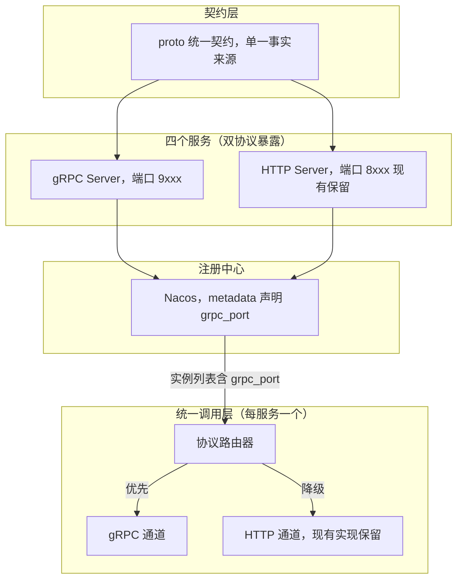
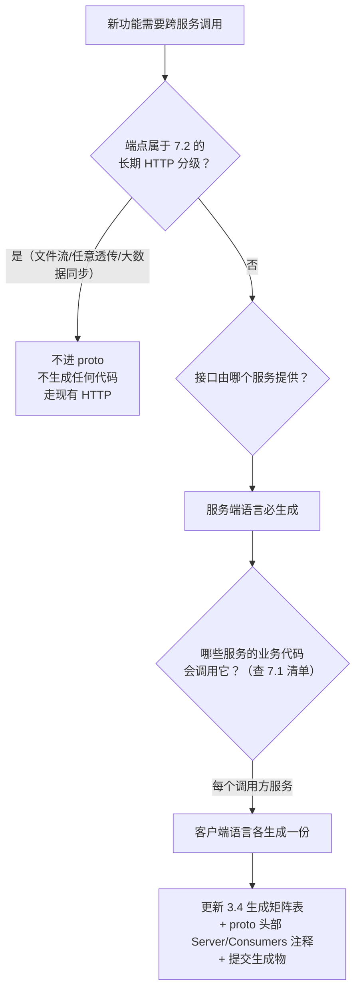
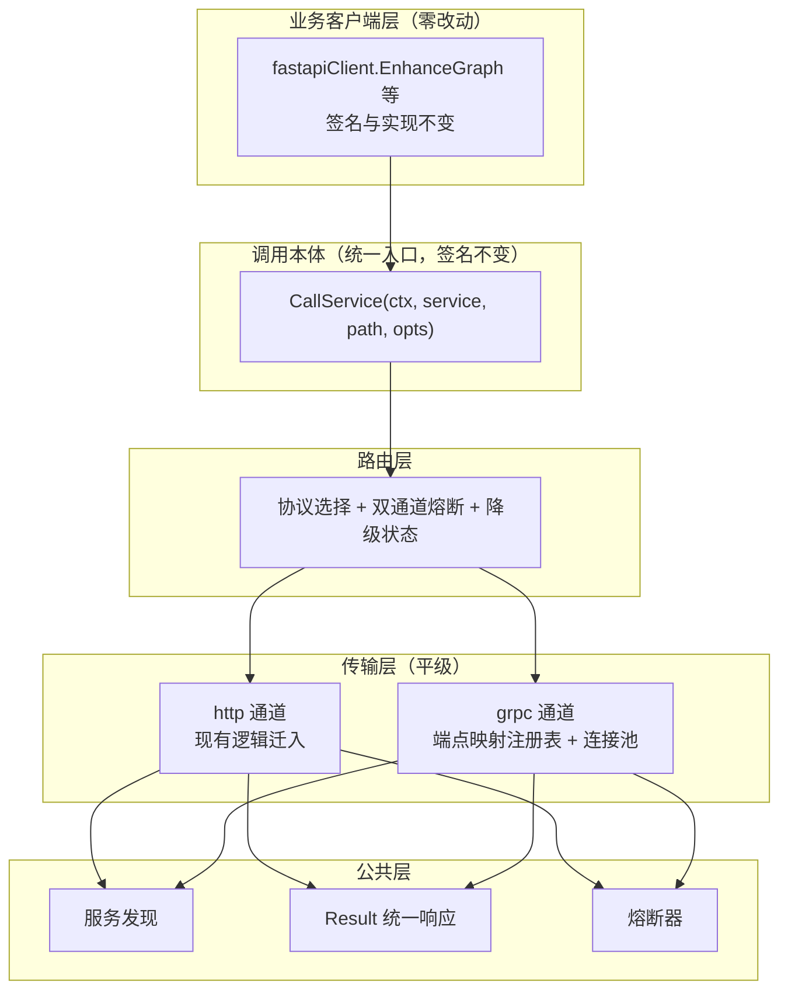

# 服务间调用 gRPC 化改造方案（HTTP 兜底）

## 一、背景与现状

当前四个核心服务（spring、nestjs、fastapi、gozero）之间的远程调用采用同构的 HTTP 模式，每个服务具备对称的调用设施：

| 设施       | Spring                      | NestJS             | FastAPI                     | GoZero                    |
| ---------- | --------------------------- | ------------------ | --------------------------- | ------------------------- |
| 服务发现   | Nacos                       | Nacos              | Nacos                       | Nacos                     |
| 调用客户端 | `ServiceWebClient`          | `nacos.service.ts` | `core/client/client.py`     | `internal/client/*Client` |
| 熔断       | Resilience4j                | opossum            | 自研 `SimpleCircuitBreaker` | ServiceDiscovery 内置     |
| 上下文透传 | `X-User-Id` 等头 + 内部令牌 | 同左               | 同左                        | 同左                      |

关键结论：调用抽象已收敛在每服务一个客户端类里，改造只需替换这四个类的内部实现，业务代码零改动。

## 二、总体架构



核心原则：

1. 业务客户端的业务函数签名与实现零改动，调用方零感知，降级收敛在调用本体内部
2. HTTP 通道与现有逻辑原样保留，作为兜底长期存在
3. gRPC 与 HTTP 各自独立的熔断器，互不连带
4. 协议选择由配置开关控制，支持灰度与回滚
5. 用户上下文契约（五项身份信息）在两种协议下保持一致

## 三、统一契约定义

### 3.1 proto 文件组织

在仓库根目录新建 `proto/` 目录，按服务拆分：

```
proto/
  fastapi/
    search_enhance.proto
  gozero/
    chat.proto
    search.proto
  spring/
    article.proto
  nestjs/
    table_settings.proto
  common/
    result.proto
```

### 3.2 通用响应结构

`proto/common/result.proto`：

```protobuf
syntax = "proto3";
package common.v1;

// 通用响应，data 用 JSON 字节承载，对齐各服务现有 Result 结构
// 迁移期务实做法，后续可逐步细化强类型消息
message Result {
  int32 code = 1;
  string message = 2;
  bytes data = 3;
}
```

### 3.3 首个接口：图谱增强

`proto/fastapi/search_enhance.proto`：

```protobuf
syntax = "proto3";
package fastapi.v1;
option go_package = "app/proto/fastapiv1";

import "common/result.proto";

service SearchEnhance {
  rpc EnhanceGraph (GraphEnhanceRequest) returns (common.v1.Result);
  rpc EnhanceVector (VectorEnhanceRequest) returns (common.v1.Result);
}

message GraphEnhanceRequest {
  int64 user_id = 1;
  string keyword = 2;
  repeated int64 article_ids = 3;
  string category_name = 4;
  string sub_category_name = 5;
  repeated string tags = 6;
  int32 limit = 7;
  string mode = 8;
}

message VectorEnhanceRequest {
  int64 user_id = 1;
  string keyword = 2;
  repeated int64 article_ids = 3;
  string category_name = 4;
  string sub_category_name = 5;
  repeated string tags = 6;
  int32 limit = 7;
  int32 top_k = 8;
  string mode = 9;
}
```

### 3.4 代码生成

生成代码统一放在各服务的 `proto/` 目录下，与手写代码隔离，入库提交（不依赖 CI 生成）。各语言生成位置：

- gozero：`gozero/app/proto/`（由 proto 的 `option go_package = "app/proto/fastapiv1"` 声明）
- fastapi：`fastapi/app/proto/`
- nestjs：`nestjs/src/proto/`
- spring：`spring/src/main/java/com/hcsy/spring/proto/`

### 生成矩阵

**只给"服务提供方 + 实际调用方"生成，不为不消费的服务生成**（避免出现服务里躺着永远不用的 stub）。每个 proto 的生成范围由 7.1 清单推导：

| proto                                                                 | 服务端（Python/Go/Java/TS） | 客户端                  | 生成到                                                |
| --------------------------------------------------------------------- | --------------------------- | ----------------------- | ----------------------------------------------------- |
| `proto/fastapi/search_enhance.proto`                                  | fastapi                     | gozero                  | fastapi(Python)、gozero(Go)                           |
| `proto/fastapi/algorithm.proto`（weights/script/script-params）       | fastapi                     | gozero                  | fastapi(Python)、gozero(Go)                           |
| `proto/fastapi/ai_history.proto`                                      | fastapi                     | gozero                  | fastapi(Python)、gozero(Go)                           |
| `proto/fastapi/task.proto`（vector/clear-caches/sync-neo4j）          | fastapi                     | spring                  | fastapi(Python)、spring(Java)                         |
| `proto/gozero/task.proto`（syncer）                                   | gozero                      | spring                  | gozero(Go)、spring(Java)                              |
| `proto/gozero/sql_tools.proto`                                        | gozero                      | fastapi                 | gozero(Go)、fastapi(Python)                           |
| `proto/spring/article.proto`（批量/列表/用户文章）                    | spring                      | gozero、fastapi、nestjs | spring(Java)、gozero(Go)、fastapi(Python)、nestjs(TS) |
| `proto/spring/category.proto`                                         | spring                      | gozero、fastapi         | spring(Java)、gozero(Go)、fastapi(Python)             |
| `proto/spring/statistics.proto`（统计/互动/关注/画像）                | spring                      | fastapi、nestjs         | spring(Java)、fastapi(Python)、nestjs(TS)             |
| `proto/nestjs/log.proto`（search-history/view-distribution/keywords） | nestjs                      | gozero、fastapi         | nestjs(TS)、gozero(Go)、fastapi(Python)               |
| `proto/nestjs/email.proto`（send-code）                               | nestjs                      | spring                  | nestjs(TS)、spring(Java)                              |

规则：新增一个 proto 时，先在 7.1 清单确认调用方，再按"服务端 1 语言 + 每个客户端 1 语言"确定生成范围；某服务的调用关系变化（新调用或下线）时同步增删该服务的生成目录。

#### 新增 proto 的判定流程



四步判定：

1. **先判端点形态**——属于 7.2"长期 HTTP"分级的（文件流、任意透传、大数据同步），不进 proto，零生成
2. **服务端唯一**——接口由哪个服务提供，该服务语言生成服务端骨架，没有歧义
3. **客户端看已实现的调用关系**——7.1 清单里哪些服务会调用它，每个调用方语言生成一份 stub；"未来可能调用"不算，等真实现调用链时再补生成
4. **同步登记**——生成矩阵表加一行、proto 头部注释更新、生成物随 proto 变更一起提交

#### proto 头部自声明（让矩阵可自校验）

每个 proto 文件头部用注释标注提供方与消费方，与矩阵表保持一致，也便于脚本解析：

```protobuf
// Server: fastapi
// Consumers: gozero
// 生成范围: fastapi(Python) + gozero(Go)，见 GRPC_MIGRATION_PLAN.md 生成矩阵
syntax = "proto3";
package fastapi.v1;
...
```

#### 生成脚本（实现阶段创建，统一执行入口）

生成指令不在文档中逐条罗列执行，而是实现阶段封装为统一脚本 `scripts/grpc-proto-gen.sh`（遵循仓库现有 `goctl-api-init.sh` 的脚本约定：中文注释、颜色日志函数、WORKDIR 自解析、工具存在性检查）。脚本实现要求：

1. **矩阵内置**：脚本顶部定义 MATRIX 数据区块，每行格式 `proto文件|服务端服务|客户端服务(逗号分隔)`，内容与上表一致；新增 proto 只需在 MATRIX 加一行
2. **按矩阵自动分发**：每行推导"服务端语言 + 去重后的客户端语言"，分发到对应生成命令
3. **各语言生成命令**：
   - Python：fastapi venv 的 `grpc_tools.protoc`，输出 `fastapi/app/proto`
   - Go：`protoc --go_opt=module=app --go-grpc_opt=module=app`（go.mod module 为 `app`），输出 `gozero/app/proto`
   - Java：输出 `spring/src/main/java/com/hcsy/spring/proto`；生成前校验 proto 已声明 `java_package`，未声明则警告跳过
   - TypeScript：在 nestjs 目录用本地 `grpc_tools_node_protoc`，输出 `nestjs/src/proto`
4. **调用方式**：无参生成矩阵全部；`-p <文件名>` 按文件名过滤单个 proto；`-l` 仅列出矩阵与各 proto 的生成计划不执行
5. **健壮性**：无匹配的 proto 直接退出不检查工具；proto 文件不存在时警告跳过；存在失败项时最终退出码非零

## 四、端口与注册规划

| 服务    | HTTP（现有） | gRPC（新增） |
| ------- | ------------ | ------------ |
| spring  | 8081         | 9081         |
| gozero  | 8082         | 9082         |
| nestjs  | 8083         | 9083         |
| fastapi | 8084         | 9084         |

Nacos 注册时在 metadata 声明 gRPC 能力（兜底判断的依据）：

```json
"metadata": { "version": "1.0.0", "grpc_port": "9084", "protocols": "grpc,http" }
```

`docker-compose.yml` 为每个服务增加 gRPC 端口映射。

## 五、各服务端实现

### 5.1 FastAPI 服务端（grpc.aio）

新增文件：

- `fastapi/app/core/grpc/__init__.py`：导出 `GrpcServerManager`
- `fastapi/app/core/grpc/server.py`：服务器生命周期管理
- `fastapi/app/core/grpc/interceptors.py`：上下文桥接
- `fastapi/app/core/grpc/servicer.py`：业务委托

`server.py` 核心设计：

```python
class GrpcServerManager:
    """grpc.aio 服务器，与 uvicorn 共享 asyncio 事件循环"""

    def __init__(self, port: int) -> None:
        self._server: Optional[grpc.aio.Server] = None
        self._port: int = port

    async def start(self) -> None:
        self._server = grpc.aio.server(
            interceptors=[UserContextInterceptor(), InternalTokenInterceptor()],
        )
        add_SearchEnhanceServicer_to_server(SearchEnhanceServicer(), self._server)
        self._server.add_insecure_port(f"[::]:{self._port}")

    async def stop(self) -> None:
        if self._server:
            await self._server.stop(grace=5)
```

`interceptors.py` 核心设计：从 gRPC metadata 提取用户上下文，写入现有 `contextvars`（复用 `contextMiddleware.py` 的变量与取值逻辑），handler 执行后用 Token reset，对齐现有中间件语义。

`servicer.py` 核心设计：只做协议转换，不写业务逻辑，直接调用现有 Service 层，与 HTTP 路由共享同一实现。

修改点：

- `fastapi/app/lifespan.py`：在 `set_shared_http_client` 之后启动 gRPC 服务器，`yield` 之后停止。必须在同一事件循环内启动，避免跨 loop 调度死锁
- `fastapi/application.yaml`：新增 `grpc: { port: 9084, enabled: true }`
- `fastapi/app/core/client/nacos.py`：注册 metadata 增加 `grpc_port` 与 `protocols`
- `fastapi/requirements.txt`：新增 `grpcio`、`grpcio-tools`、`protobuf`

### 5.2 GoZero 服务端（zrpc）

go-zero 的 `zrpc` 天然就是 gRPC，服务端改造最轻：

- `gozero/app/internal/config/config.go`：`Config` 增加 `ZrpcConf zrpc.RpcServerConf`
- `gozero/app/internal/boot/server.go`：`CreateServer` 同时创建 rest server 与 zrpc server
- `gozero/app/internal/boot/init.go`：`Run` 中两个 server 并行启动（`group.Start`），退出时统一 Stop
- logic 层复用：zrpc 的 handler 直接调用现有 logic，`svc.ServiceContext` 原样传入
- 上下文桥接：zrpc 的 `UnaryServerInterceptor` 从 metadata 读取五项身份信息写入 `context.WithValue`（复用 `common/keys/ctxKey.go` 的键）

### 5.3 NestJS 服务端（@nestjs/microservices）

- `nestjs/src/main.ts`：使用 `app.connectMicroservice<MicroserviceOptions>(grpcOptions)` 组成 hybrid app，`app.startMicroservices()` 与 HTTP 共存
- 新增 `nestjs/src/framework/interceptors/grpcContext.interceptor.ts`：gRPC 拦截器从 metadata 读取身份信息写入 CLS
- 关键坑：`@grpc/grpc-js` 的回调不在 HTTP 中间件的异步链上，CLS 取不到值，必须用 `ClsService.run` 在拦截器里手动开启新的 CLS 上下文
- handler 复用现有 Service，proto 绑定用 `@GrpcMethod` 装饰器

### 5.4 Spring 服务端（reactive-grpc）

WebFlux 响应式栈必须使用响应式 gRPC，避免 handler 内 `.block()` 耗尽 gRPC 线程池：

- 依赖：`com.salesforce.servicelibs:reactor-grpc-stub` + `grpc-spring-boot-starter`
- 代码生成：`ReactorGrpc` 插件，接口签名直接是 `Mono/Flux`
- 服务端 handler 直接返回 `Mono<Result>`，内部复用现有 Service 响应式链，全程无 block
- `ServerInterceptor` 读 gRPC metadata，通过 `contextWrite` 写入 Reactor Context（复用 `UserContext.writeContext`）
- 客户端使用 `ReactorXxxGrpc.newReactorStub(channel)`，返回的 `Mono` 直接接入现有 `RetryOperator`/`CircuitBreakerOperator` 管道，`ServiceWebClient` 的返回类型 `Mono<Result<?>>` 保持不变

## 六、客户端统一调用层（核心）

### 6.1 分层结构设计

业务客户端的业务函数（如 `EnhanceGraph`）签名与实现完全保留不变。gRPC 与 HTTP 作为**调用本体**的两个平级传输通道，统一收纳在 client 体系下，降级发生在调用本体内部，依赖方向严格单向：



各层职责边界：

| 层           | 职责                                                               | 变更程度             |
| ------------ | ------------------------------------------------------------------ | -------------------- |
| 业务客户端层 | 组装 `RequestOptions`，提供面向接口的业务方法（如 `EnhanceGraph`） | 零改动               |
| 调用本体     | `CallService` 统一入口，签名不变，内部委托路由层                   | 仅内部实现升级       |
| 路由层       | 协议选择、双通道熔断隔离、降级状态机、错误分类                     | 新增                 |
| 传输层       | 纯协议关注点：连接管理、超时、metadata/headers、协议错误码         | http 迁入，grpc 新增 |
| 公共层       | 服务发现、Result 结构、熔断器原语                                  | 从现有代码拆出       |

关键设计决策：**统一调用本体 + 端点映射注册表**。业务函数继续构建现有的 `RequestOptions`（path + body），调用本体 `CallService` 签名不变、内部升级为路由入口。gRPC 通道通过"端点映射注册表"把 path + 动态 body 翻译为强类型 proto 调用——某个 path 只有注册了 gRPC 绑定才走 gRPC 通道，未注册的端点自动仅走 HTTP。业务代码零改动，gRPC 能力按端点声明式启用，响应侧 proto 的 `Result.data`（JSON 字节）解析回原有 `Result` 结构，业务拿到的数据形态与 HTTP 完全一致。

### 6.2 各服务的目录结构调整

GoZero（现有 `common/client/client.go` 单文件混合了配置、发现、HTTP 调用、重试、Result，需拆分；`internal/client` 业务客户端零改动）：

```
gozero/app/common/client/
  result.go                    # Result 统一响应（从 client.go 拆出）
  discovery.go                 # 服务发现与实例缓存（从 client.go 拆出）
  breaker.go                   # 熔断器原语（按 service+protocol 维度建 key）
  router.go                    # 协议路由器（新增，CallService 内部委托）
  transport/
    errors.go                  # isChannelError 错误分类（新增）
    http/
      transport.go             # 现有 CallService/doCall/retry 执行逻辑迁入
    grpc/
      transport.go             # gRPC 连接池、metadata 组装、deadline（新增）
      registry.go              # 端点映射注册表：path 到 proto 方法的绑定（新增）
gozero/app/internal/client/
  fastapiClient/               # 业务客户端（零改动，函数签名与实现不变）
  nestjsClient/
  springClient/
```

FastAPI（现有 `app/core/client/client.py` 即调用本体，`__init__.py` 导出保持不变）：

```
fastapi/app/core/client/
  __init__.py                  # 导出保持不变，调用方零感知
  nacos.py                     # 服务发现（现有保留）
  client.py                    # 调用本体：现有入口函数签名不变，内部委托路由器
  router.py                    # 协议路由器（新增）
  transport/
    __init__.py
    http_client.py             # 现有 HTTP 执行逻辑迁入（熔断、重试、连接池原样保留）
    grpc_client.py             # grpc.aio 通道（新增）
    registry.py                # 端点映射注册表（新增）
```

NestJS（现有 `module/common/nacos/nacos.service.ts` 混合了发现与 HTTP 调用）：

```
nestjs/src/module/common/nacos/
  nacos.service.ts             # 仅保留服务发现与注册
nestjs/src/common/rpc/
  invocation.service.ts        # 调用本体：现有调用入口签名不变，内部委托路由器
  router.service.ts            # 协议路由器（新增）
  http.client.ts               # HTTP 调用从 nacos.service.ts 拆出
  grpc.client.ts               # @grpc/grpc-js 通道（新增）
  registry.ts                  # 端点映射注册表（新增）
```

Spring（现有 `infra/client/ServiceWebClient.java` 的 `request()` 即调用本体）：

```
spring/src/main/java/com/hcsy/spring/infra/client/
  ServiceWebClient.java        # 调用本体：request() 方法签名不变，内部委托路由器
  ServiceRouter.java           # 协议路由器（新增）
  http/HttpTransport.java      # 现有 WebClient 执行逻辑迁入
  grpc/ReactorGrpcChannel.java # Reactor gRPC stub 封装（新增）
  grpc/EndpointRegistry.java   # 端点映射注册表（新增）
```

### 6.3 调用本体与端点映射注册表

以 GoZero 为例（其余三个同构）。业务函数零改动：`fastapiClient.go` 的 `EnhanceGraph` 仍然只构建 `RequestOptions` 并调用 `CallService`，与现在完全一致。

变化发生在调用本体内部——`CallService` 签名不变，内部委托路由器：

```go
// CallService 调用本体：签名与现有完全一致，内部升级为路由入口
func (sd *ServiceDiscovery) CallService(ctx context.Context, serviceName string,
    path string, opts RequestOptions) (Result, error) {
    return sd.router.Call(ctx, serviceName, path, opts,
        // gRPC 通道：仅当 path 在注册表中存在绑定时可用
        func(ctx context.Context) (Result, error) {
            return sd.grpcTransport.Invoke(ctx, serviceName, path, opts)
        },
        // HTTP 兜底：现有执行逻辑原样保留
        func(ctx context.Context) (Result, error) {
            return sd.httpTransport.Call(ctx, serviceName, path, opts)
        },
    )
}
```

gRPC 通道通过端点映射注册表把 path + 动态 body 翻译为强类型 proto 调用：

```go
// grpcBinding 一个 HTTP 端点到 gRPC 方法的绑定
type grpcBinding struct {
    method   string // 如 "/fastapi.v1.SearchEnhance/EnhanceGraph"
    buildReq func(body map[string]any) (proto.Message, error)
}

// registry 端点映射注册表：service 到 path 绑定的集合，启动时集中注册
var registry = map[string]map[string]grpcBinding{
    "fastapi": {
        "/graph-search/enhance": {
            method: "/fastapi.v1.SearchEnhance/EnhanceGraph",
            buildReq: func(body map[string]any) (proto.Message, error) {
                // 动态 body 到强类型消息的转换，集中在此处维护
                // ...existing code...
            },
        },
    },
}
```

注册表在服务启动时集中注册（如 `internal/client/grpcBindings.go`），某个 path 只有注册了绑定才具备 gRPC 能力，未注册的端点自动仅走 HTTP，业务代码与调用方均无感知。响应侧 gRPC 返回的 `Result.data`（JSON 字节）解析回原有 `Result` 结构，业务拿到的数据形态与 HTTP 完全一致。

### 6.4 兜底策略的四个关键设计

1. **启动探测**：实例 metadata 无 `grpc_port` 或 gRPC 通道连接失败，直接走 HTTP，不重试 gRPC
2. **通道级熔断隔离**：gRPC 和 HTTP 各自独立的熔断器实例，熔断器 key 按 `(service, protocol)` 两个维度建立。gRPC 熔断打开时自动全量走 HTTP，HTTP 熔断打开时才真正报错。兜底不能共享熔断器，否则 gRPC 故障会连带熔断 HTTP 通道
3. **降级恢复**：gRPC 熔断器半开状态放行探测请求，成功即回升到 gRPC 优先
4. **错误语义映射**：gRPC `UNAVAILABLE`/`DEADLINE_EXCEEDED` 触发降级；`INVALID_ARGUMENT`/`NOT_FOUND` 属业务错误，直接抛出不降级，避免把业务错误当通道故障放大重试

错误分类函数 `isChannelError` 放在 `transport/errors.go`，是两个传输通道共同遵守的公共契约，路由层依赖它做降级决策。

### 6.5 上下文透传

HTTP headers 平移为 gRPC metadata，键名保持一致：

| HTTP 头            | gRPC metadata 键                      |
| ------------------ | ------------------------------------- |
| `X-User-Id`        | `x-user-id`                           |
| `X-Username`       | `x-username`                          |
| `X-Session-Id`     | `x-session-id`                        |
| `Authorization`    | `authorization`（Bearer token）       |
| `X-Internal-Token` | `x-internal-token`（Bearer 内部令牌） |

内部令牌生成逻辑（`InternalTokenUtil`，HS256 JWT，`userId=-1` 表示系统调用）完全复用，四个服务各自的"metadata 到本服务上下文"拦截器与现有 HTTP 中间件逐行对应。

超时映射：现有 `remote_call.timeout` 配置映射为 gRPC deadline（Python 的 `timeout=` 参数、Java 的 `withDeadlineAfter`、Go 的 `context.WithTimeout`），保持语义一致。

## 七、分阶段实施与远程调用全量清单

实施分三个阶段：先搭建与业务流量无关的基础设施，再迁移少量试点调用验证成功，最后全量迁移。每个阶段有明确的验收标准，试点失败只影响试点端点（回滚 = 注册表移除绑定），不影响其他调用。

### 7.1 远程调用全量清单

以下为四个服务当前全部的跨服务调用点（2026-09 勘察），实现阶段直接按此清单注册 proto 绑定，无需再深度查看代码。

**GoZero 作为客户端（20 个方法，3 个目标服务）**

| 目标服务 | 客户端方法                                  | HTTP   | 端点                                    | 调用方                             |
| -------- | ------------------------------------------- | ------ | --------------------------------------- | ---------------------------------- |
| fastapi  | `FastapiClient.EnhanceGraph`                | POST   | `/graph-search/enhance`                 | logic/search/searchArticlesLogic   |
| fastapi  | `FastapiClient.EnhanceVector`               | POST   | `/vector-search/enhance`                | logic/search/searchArticlesLogic   |
| fastapi  | `FastapiClient.GetSearchWeights`            | GET    | `/algorithm/search/weights`             | logic/search/searchArticlesLogic   |
| fastapi  | `FastapiClient.GetSearchScript`             | GET    | `/algorithm/search/script`              | logic/search/searchArticlesLogic   |
| fastapi  | `FastapiClient.GetSearchScriptParams`       | GET    | `/algorithm/search/script-params`       | logic/search/searchArticlesLogic   |
| fastapi  | `FastapiClient.GetAiHistoryByID`            | GET    | `/ai_history/internal/:id`              | logic（AI 历史）                   |
| fastapi  | `FastapiClient.UpdateAiHistory`             | PUT    | `/ai_history/internal/:id`              | logic（AI 历史）                   |
| fastapi  | `FastapiClient.DeleteAiHistory`             | DELETE | `/ai_history/internal/:id`              | logic（AI 历史）                   |
| nestjs   | `NestjsClient.GetSearchHistory`             | GET    | `/article-logs/search-history/:user_id` | logic/search/getSearchHistoryLogic |
| spring   | `SpringClient.GetPublishedArticles`         | GET    | `/articles/list`                        | task/logic/esSyncerTask            |
| spring   | `SpringClient.GetArticleViewsByIDs`         | POST   | `/articles/views/batch`                 | task/logic/esSyncerTask            |
| spring   | `SpringClient.GetArticlesByIDs`             | POST   | `/articles/batch`                       | task/logic/esSyncerTask            |
| spring   | `SpringClient.GetUserByID`                  | GET    | `/users/:id`                            | task/logic/esSyncerTask            |
| spring   | `SpringClient.GetUsersByIDs`                | POST   | `/users/batch`                          | task/logic/esSyncerTask            |
| spring   | `SpringClient.GetCommentScoresByArticleIDs` | POST   | `/comments/scores/batch`                | task/logic/esSyncerTask            |
| spring   | `SpringClient.GetLikeCountsByArticleIDs`    | POST   | `/likes/counts/batch`                   | task/logic/esSyncerTask            |
| spring   | `SpringClient.GetCollectCountsByArticleIDs` | POST   | `/collects/counts/batch`                | task/logic/esSyncerTask            |
| spring   | `SpringClient.GetFollowCountsByUserIDs`     | POST   | `/focus/counts/batch`                   | task/logic/esSyncerTask            |
| spring   | `SpringClient.GetCategoriesByIDs`           | POST   | `/category/batch`                       | task/logic/esSyncerTask            |
| spring   | `SpringClient.GetSubCategoriesByIDs`        | POST   | `/category/sub/batch`                   | task/logic/esSyncerTask            |

**FastAPI 作为客户端（约 50 个方法，3 个目标服务）**

| 目标服务 | 客户端         | 端点（方法内全部路径）                                                                                                                                                                                                                                                                                                  | 用途                   |
| -------- | -------------- | ----------------------------------------------------------------------------------------------------------------------------------------------------------------------------------------------------------------------------------------------------------------------------------------------------------------------- | ---------------------- |
| spring   | `SpringClient` | `/articles/batch`、`/articles/views/batch`、`/users/batch`、`/comments/scores/batch`、`/likes/counts/batch`、`/collects/counts/batch`、`/focus/counts/batch`、`/category/batch`、`/category/sub/batch`                                                                                                                  | 批量数据（9 个）       |
| spring   | `SpringClient` | `/category/internal/all`、`/category/internal/sub/with-parent`、`/category/reference/sub/{id}`                                                                                                                                                                                                                          | 分类维度（3 个）       |
| spring   | `SpringClient` | `/articles/list`、`/articles/statistics/total-views`、`/articles/statistics/total`、`/articles/statistics/active-authors`、`/articles/statistics/average-views`、`/articles/statistics/excel-export`、`/articles/statistics/top10`、`/articles/statistics/category-count`、`/articles/statistics/monthly-publish-count` | 文章统计（9 个）       |
| spring   | `SpringClient` | `/likes/statistics/total`、`/likes/statistics/average`、`/likes/statistics/monthly-trend/{id}`、`/collects/statistics/total`、`/collects/statistics/average`、`/collects/statistics/monthly-trend/{id}`、`/comments/internal/create`                                                                                    | 互动统计（7 个）       |
| spring   | `SpringClient` | `/focus/statistics/followers-in-period/{id}`、`/focus/statistics/daily-follows/{id}`、`/focus/statistics/total-follows/{id}`、`/focus/statistics/monthly-trend/{id}`                                                                                                                                                    | 关注统计（4 个）       |
| spring   | `SpringClient` | `/articles/user/{id}`（发文数/阅读量）、`/likes/user/{id}`、`/collects/user/{id}`、`/focus/count/follower/{id}`                                                                                                                                                                                                         | 用户画像（5 个）       |
| spring   | `SpringClient` | `/warehouse/sync/{resource}`                                                                                                                                                                                                                                                                                            | 数仓增量同步（分页流） |
| spring   | `SpringClient` | `/users/neo4j-sync`、`/category/internal/neo4j-sync`、`/category/internal/sub/neo4j-sync`、`/articles/neo4j-sync`、`/likes/neo4j-sync`、`/collects/neo4j-sync`、`/comments/neo4j-sync`、`/focus/neo4j-sync`                                                                                                             | Neo4j 同步（8 个）     |
| spring   | `SpringClient` | `/sql-tools/tables`、`/sql-tools/query`                                                                                                                                                                                                                                                                                 | SQL 代理（透传）       |
| nestjs   | `NestjsClient` | `/api-logs/average-speed`、`/api-logs/called-count`、`/article-logs/search-keywords`、`/article-logs/view-distribution/{id}`、`/mongo-tools/collections`、`/mongo-tools/query`、`/article-logs/sync`                                                                                                                    | 日志与代理（7 个）     |
| nestjs   | `NestjsClient` | `/upload`                                                                                                                                                                                                                                                                                                               | 文件上传（流式传输）   |
| gozero   | `GozeroClient` | `/sql-tools/tables`、`/sql-tools/query`                                                                                                                                                                                                                                                                                 | SQL 代理（透传）       |

**Spring 作为客户端（5 个端点，3 个目标服务）**

| 目标服务 | 客户端方法                         | HTTP | 端点                         | 调用方                                        |
| -------- | ---------------------------------- | ---- | ---------------------------- | --------------------------------------------- |
| fastapi  | `FastAPIClient.syncVector`         | POST | `/task/vector`               | api/service/impl/AsyncSyncServiceImpl         |
| fastapi  | `FastAPIClient.clearAnalyzeCaches` | POST | `/task/clear-analyze-caches` | api/service/impl/AsyncSyncServiceImpl         |
| fastapi  | `FastAPIClient.syncNeo4j`          | POST | `/task/sync-neo4j`           | api/service/impl/AsyncNeo4jSyncServiceImpl    |
| gozero   | `GoZeroClient.syncES`              | POST | `/task/syncer`               | api/service/impl/AsyncSyncServiceImpl         |
| nestjs   | `NestjsClient.sendEmailCode`       | POST | `/email/send-code`           | api/service/impl/EmailVerificationServiceImpl |

**NestJS 作为客户端（10 个端点，1 个目标服务）**

| 目标服务 | 客户端方法                                   | HTTP | 端点                             | 调用方                              |
| -------- | -------------------------------------------- | ---- | -------------------------------- | ----------------------------------- |
| spring   | `SpringClientService.getUserById`            | GET  | `/users/{id}`                    | 模块业务                            |
| spring   | `SpringClientService.getUserByIds`           | POST | `/users/batch`                   | 模块业务                            |
| spring   | `SpringClientService.getUsersByName`         | GET  | `/users/by-name`                 | 模块业务                            |
| spring   | `SpringClientService.getUserByGithubId`      | GET  | `/users/by-github-id/{githubId}` | github 登录                         |
| spring   | `SpringClientService.findOrCreateGithubUser` | POST | `/users/github-user`             | github 登录                         |
| spring   | `SpringClientService.isAdminUser`            | GET  | `/users/{userId}/is-admin`       | framework/guards/requireAdmin.guard |
| spring   | `SpringClientService.createTokenTicket`      | POST | `/users/github/token-ticket`     | github 登录                         |
| spring   | `SpringClientService.getArticleById`         | GET  | `/articles/{id}`                 | articleLog 等模块                   |
| spring   | `SpringClientService.getArticleByIds`        | POST | `/articles/batch`                | 模块业务                            |
| spring   | `SpringClientService.getArticlesByTitle`     | GET  | `/articles/by-title`             | 模块业务                            |

### 7.2 端点迁移分级

| 分级      | 判定标准                                                                                                                                                                                                               | 处理                    |
| --------- | ---------------------------------------------------------------------------------------------------------------------------------------------------------------------------------------------------------------------- | ----------------------- |
| 首批试点  | 查询/幂等、参数结构简单、调用频次高、验证价值大                                                                                                                                                                        | 阶段二注册 gRPC 绑定    |
| 全量迁移  | 其余查询类、幂等写类（PUT/DELETE 语义明确）                                                                                                                                                                            | 阶段三注册              |
| 长期 HTTP | 文件流（`/upload`、`/articles/statistics/excel-export`）、任意透传（`/sql-tools/*`、`/mongo-tools/query`，body 结构不定无法映射 proto）、大数据同步流（`/warehouse/sync`、`/neo4j-sync`、`/task/syncer` 等任务触发类） | 不注册绑定，永久走 HTTP |

### 7.3 三阶段实施

**阶段一：基础设施（零业务流量）**

1. proto 契约定义 + 四语言代码生成（仅试点端点 + 通用 Result）
2. 四服务 gRPC Server + 上下文拦截器 + Nacos metadata 声明
3. 四服务 client 传输层拆分（公共层 + http 传输迁入）+ 协议路由器 + 空注册表
4. 配置开关、compose 端口

验收标准：全部服务 `http-only` 配置下全量回归通过，行为与现在完全一致；gRPC 端口健康检查通过；调用方代码 diff 为零。

**阶段二：试点迁移（部分远程调用，验证成功）**

试点端点（3 个，均为查询/幂等、链路短、proto 结构简单、且分布在两个不同调用链验证通用性）：

| 端点                                | 调用链           | 理由                                                         |
| ----------------------------------- | ---------------- | ------------------------------------------------------------ |
| fastapi `/graph-search/enhance`     | gozero → fastapi | 方案既定最小闭环，POST 但幂等（纯检索增强）                  |
| fastapi `/vector-search/enhance`    | gozero → fastapi | 与上同一个 Servicer，边际成本为零，且走 `mr.Finish` 并行路径 |
| fastapi `/algorithm/search/weights` | gozero → fastapi | GET 查询，验证 GET 型端点与 query 参数映射                   |

验证动作与成功标准：

1. `sync_warehouse` 之外的业务日志确认 gRPC 通道命中（gozero 侧路由器日志 + fastapi 侧拦截器日志）
2. 响应一致性对比：同参数分别强制走 gRPC/HTTP，`Result` 结构与 `data` JSON 完全一致
3. 降级演练：停 fastapi 9084 端口，确认自动降级 HTTP 且业务无感；恢复后熔断器半开回升
4. 性能对比：gRPC 与 HTTP 的 P99 延迟对比（预期 gRPC 更低）
5. 上下文透传验证：下游读取 `x-user-id` 与内部令牌正确
6. **观察期至少一周，试点稳定后才进入阶段三**；试点失败回滚 = 注册表移除绑定，秒级生效

**阶段三：全量迁移**

1. 按服务对补齐 proto 定义（spring 的 11+10 个批量/统计端点、nestjs 的 search-history、AI 历史读写等），生成代码
2. 各服务注册表批量登记 7.1 清单中"全量迁移"分级的端点
3. 观察各调用链 gRPC 熔断器指标一周
4. 稳定后 HTTP 通道保留为兜底长期存在（不再推进"HTTP 退役"，长期双协议）

### 7.4 配置开关

四个服务的 `application.yaml` 统一增加：

```yaml
remote_call:
  protocol: grpc-first # grpc-first | http-only
```

开关与注册表是双重控制：注册表决定"哪些端点具备 gRPC 能力"，开关决定"具备能力的端点是否优先走 gRPC"。阶段一两者全关（空注册表 + http-only），阶段二注册试点端点并切 `grpc-first`，阶段三补齐注册表。

## 八、已知风险与规避

| 风险                   | 影响服务 | 规避措施                                                    |
| ---------------------- | -------- | ----------------------------------------------------------- |
| gRPC handler 阻塞冲突  | spring   | 使用 reactive-grpc，handler 返回 Mono/Flux，禁止 block      |
| 跨事件循环死锁         | fastapi  | grpc.aio server 必须在 lifespan 中与 uvicorn 同一 loop 启动 |
| CLS 在 gRPC 回调中断链 | nestjs   | 拦截器中用 `ClsService.run` 手动开启 CLS 上下文             |
| Nacos 服务发现对接     | gozero   | zrpc 默认 etcd，需引入 nacos-resolver 自定义 resolver       |
| 业务错误误判为通道故障 | 全部     | 错误语义映射，仅 UNAVAILABLE/DEADLINE_EXCEEDED 降级         |
| 容器端口遗漏           | 全部     | docker-compose.yml 同步增加 9xxx 端口映射                   |

## 九、验证步骤

1. `protoc` 生成各语言代码，`go build ./...` 校验 Go 编译，`mvn clean package` 校验 Spring，`npm run node:build` 校验 NestJS
2. FastAPI 侧验证 `grpcio` 依赖导入正常
3. 阶段一验收：`http-only` 下全量回归，gRPC 端口健康检查通过
4. 阶段二验收：gozero 调用图谱增强接口，日志确认 gRPC 通道命中；响应一致性对比；降级演练与半开回升；P99 对比；上下文透传验证
5. 阶段三验收：按 7.1 清单逐服务对注册端点，观察各调用链 gRPC 熔断器指标一周

## 十、依赖清单

| 服务    | 新增依赖                                                              |
| ------- | --------------------------------------------------------------------- |
| gozero  | `google.golang.org/grpc`（zrpc 已间接引入，无需新增）                 |
| fastapi | `grpcio`、`grpcio-tools`、`protobuf`                                  |
| nestjs  | `@grpc/grpc-js`、`@grpc/proto-loader`、`@nestjs/microservices`        |
| spring  | `reactor-grpc-stub`、`grpc-spring-boot-starter`、`reactive-grpc` 插件 |

## 十一、实施顺序（三阶段推进）

| 阶段         | 内容                                                           | 涉及文件                                                                                                                                                   |
| ------------ | -------------------------------------------------------------- | ---------------------------------------------------------------------------------------------------------------------------------------------------------- |
| 一：基础设施 | proto 契约（试点端点 + 通用 Result）+ 四语言代码生成           | `proto/` 目录                                                                                                                                              |
| 一：基础设施 | 四服务 gRPC Server + 上下文拦截器 + Nacos metadata             | 各服务启动文件、`lifespan.py`、`main.ts`、`nacos.py`、`nacos.service.ts`                                                                                   |
| 一：基础设施 | client 传输层拆分（公共层 + http 传输）+ 协议路由器 + 空注册表 | `common/client/client.go`、`core/client/client.py`、`nacos.service.ts`、`ServiceWebClient`、`router.go`、`router.py`、`router.service.ts`、`ServiceRouter` |
| 一：基础设施 | 配置开关 + 端口 + compose                                      | 各 `application.yaml`、`docker-compose.yml`                                                                                                                |
| 二：试点迁移 | fastapi 服务端 servicer + 3 个试点端点注册表绑定               | `core/grpc/servicer.py`、gozero `grpcBindings.go`                                                                                                          |
| 二：试点迁移 | 试点验证（一致性/降级/性能/上下文）+ 一周观察期                | 见 7.3 验证动作                                                                                                                                            |
| 三：全量迁移 | 按服务对补齐 proto + 生成代码 + 批量注册 7.1 清单端点          | `proto/spring/`、`proto/nestjs/`、各服务注册表                                                                                                             |
| 三：全量迁移 | 全链路熔断指标观察                                             | 各服务监控                                                                                                                                                 |

原则：阶段一不含任何业务流量变化；阶段二只动 3 个端点且可秒级回滚；阶段三按 7.1 清单机械化铺开，无需再深度查看代码。
